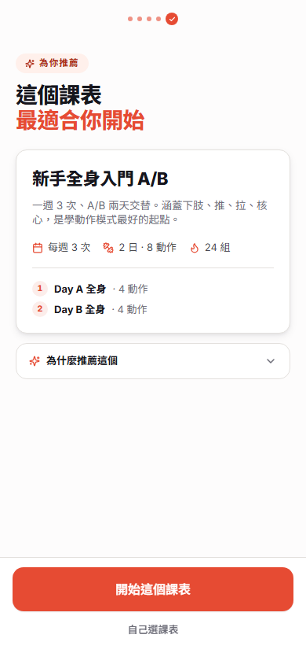
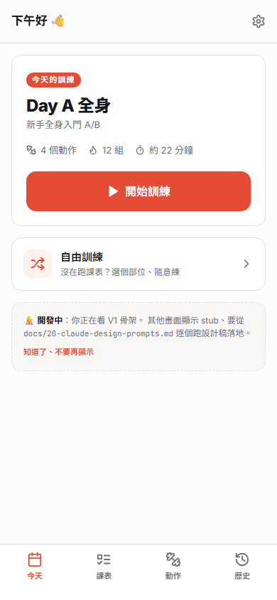
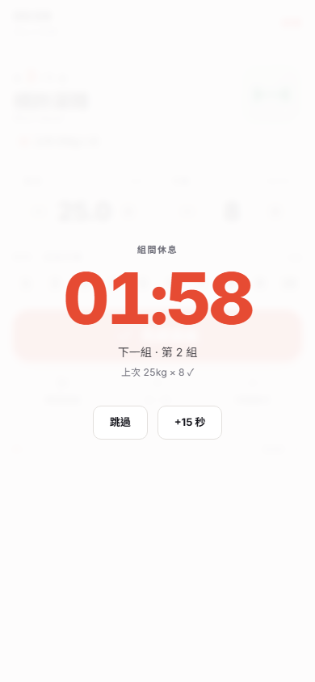
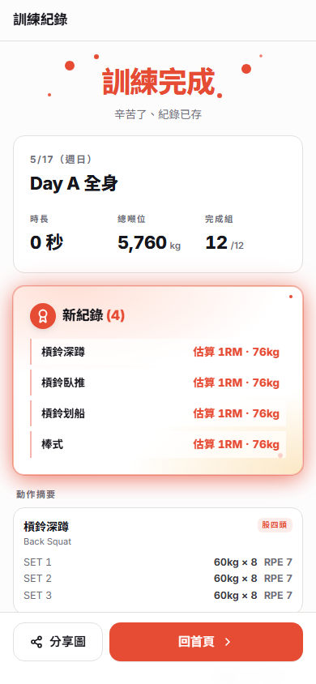
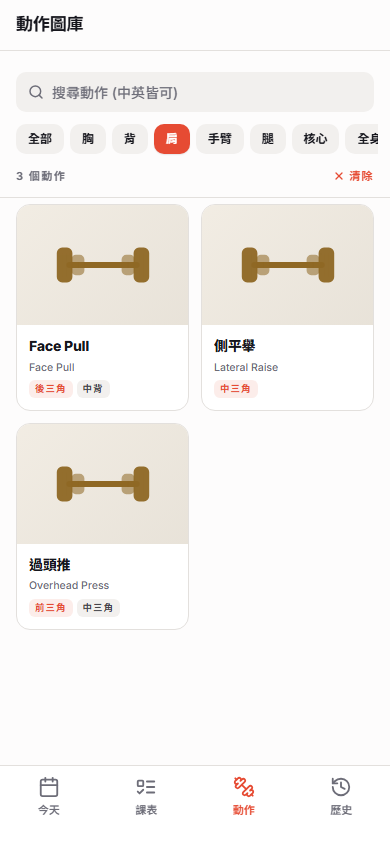
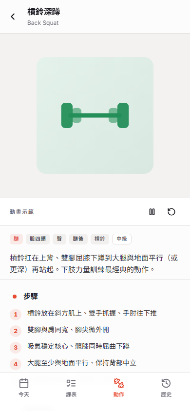
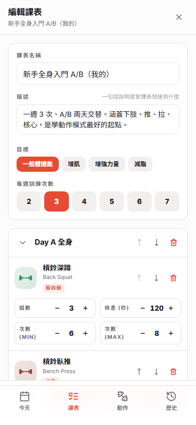
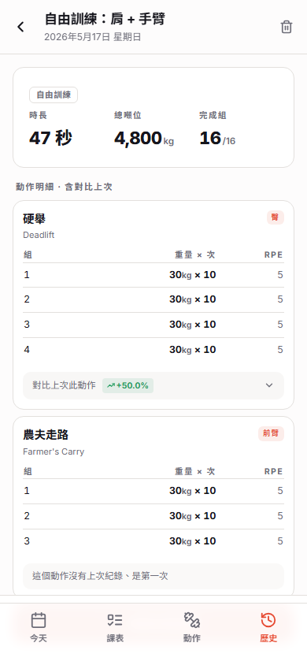
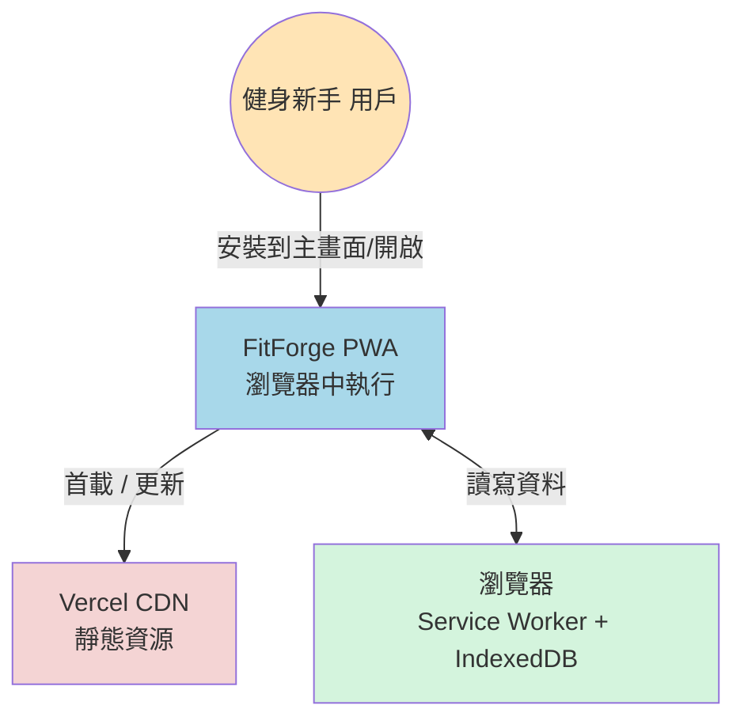

<div align="center">


# FitForge

**健身入門 PWA — 離線可用、零註冊、3 套預設課表 + 30 個動作圖庫**

[](https://fitness-app-iota-steel.vercel.app)

[](https://www.typescriptlang.org/)
[](https://react.dev/)
[](https://vitejs.dev/)
[](https://tailwindcss.com/)
[](https://rxdb.info/)
[](packages/core/tests)
[](packages/web/vite.config.ts)
[](README.md)

</div>

---

## ✨ 給「想開始重訓但不知從何下手」的新手

一個**離線可用、零註冊、教學完整**的健身入門 PWA：

- 🎯 **三套預設課表**帶你入門（全身入門 A/B、上下分化、推拉腿）
- 💪 **30 個動作圖庫**含中英文名、肌群標籤、注意事項
- 📝 **訓練紀錄追蹤**重量 / 次數 / RPE、組間自動倒數
- 🔥 **PR 慶祝 + 教練留言**完成後自動偵測新紀錄、給下次具體建議
- 📊 **歷史對比**每動作自動對比上次表現 (±%)
- 🛠️ **自訂課表**完整 CRUD 編輯器、可從預設複製再改
- 🤸 **自由訓練**沒跑課表也可選部位即時組課表
- 📱 **完全 PWA**安裝到主畫面、訓練中可斷網

---

## 📱 體驗

**▶ Live demo：https://fitness-app-iota-steel.vercel.app**

手機 Safari / Chrome 打開 → 「加入主畫面」即可像 native app 使用。

<div align="center">

| Onboarding 推薦 | Today 主畫面 | 訓練中 + 倒數 | 完成 + PR 慶祝 |
|:-:|:-:|:-:|:-:|
|  |  |  |  |

| 動作圖庫 (篩選) | 動作詳情 | 自訂課表編輯器 | 歷史對比上次 |
|:-:|:-:|:-:|:-:|
|  |  |  |  |

</div>

---

## 🏗 架構

**Monorepo · pnpm workspaces · 業務邏輯與 UI 嚴格隔離**

```
fitness-app/
├── packages/
│   ├── core/        # 純 TypeScript 業務邏輯 (V1/V2 共用)
│   │   ├── data/    # RxDB schemas + repositories + seeds
│   │   ├── domain/  # WorkoutEngine / PlanService / StatsService ...
│   │   ├── ports/   # ClockPort / IdPort / AIPort (V2 預留)
│   │   └── adapters/
│   └── web/         # Vite + React + Tailwind + shadcn-style
│       ├── app/     # 17 個 pages (Today/Plans/Workout/History/Settings ...)
│       ├── features/# domain-specific hooks + components
│       ├── stores/  # Zustand (UI + session state)
│       ├── ui/      # 基礎組件 (Button / Card / Chip / Sheet / NumberStepper)
│       └── lib/     # core provider / theme / router / rxdb hooks
└── docs/            # SDD (14 檔) + Mermaid 圖 + Claude Design 設計稿
```

### 系統 Context (C4 Level 1)



**特性**：除了首載、整個系統可完全離線。無後端、無資料庫伺服器、無第三方 API。  
完整架構圖見 [docs/SDD.md](docs/SDD.md) §2 與 [docs/diagrams/](docs/diagrams/)。

---

## 🛠 技術選型重點

| 層 | 選擇 | 為什麼 |
|----|------|--------|
| 構建 | **Vite 5** | 啟動 < 1s、PWA 整合無摩擦 |
| 語言 | **TypeScript 5** strict | 型別共用、單元測試友善 |
| UI | **React 18 + Tailwind + shadcn-style** | 客製化高、組件源碼可控 |
| 狀態 | **Zustand (UI) + RxDB hooks (資料)** | 兩種狀態本質不同、分流避免痛苦 |
| 本地 DB | **RxDB 15 + Dexie** | reactive query 內建、V2 雲端同步幾乎免改 |
| 驗證 | **Zod 3** | TS 型別由 schema 推導、單一真相 |
| 動畫 | Lottie (預留) + framer-motion (待加) | 檔案小、離線、retina 銳利 |
| PWA | **vite-plugin-pwa + Workbox** | precache + runtime cache + manifest |
| 測試 | **Vitest + fake-indexeddb** | 41 個 core 測試、in-memory RxDB |
| 部署 | **Vercel** | git push 自動 deploy、HTTPS、CDN |

完整 ADRs 見 [docs/03-tech-stack.md](docs/03-tech-stack.md)。

---

## 📚 完整文件

`docs/` 內有完整 SDD（軟體設計文件）、超詳細：

| # | 文件 | 內容 |
|---|------|------|
| 00 | [SDD.md](docs/SDD.md) | 主架構索引 + 執行摘要 + 15 個 ADR |
| 01 | [Product Overview](docs/01-product-overview.md) | 產品定位、Persona、MVP 範疇、User Stories |
| 02 | [System Architecture](docs/02-system-architecture.md) | 分層、C4 圖、模組互動 |
| 03 | [Tech Stack](docs/03-tech-stack.md) | 每項選型的理由與替代方案 |
| 04 | [Data Model](docs/04-data-model.md) | RxDB schemas、ER 圖、migration |
| 05 | [Domain Logic](docs/05-domain-logic.md) | WorkoutEngine 狀態機、Domain Services |
| 06 | [State Management](docs/06-state-management.md) | Zustand vs RxDB 分流策略 |
| 07 | [Screen Flow](docs/07-screen-flow.md) | 17 個畫面 + Route map + 導覽圖 |
| 08 | [PWA & Offline](docs/08-pwa-offline.md) | Service Worker 策略、Lottie 預載 |
| 09 | [Monorepo Structure](docs/09-monorepo-structure.md) | 完整 file tree + 設定檔 |
| 10 | [AI Extension Points](docs/10-ai-extension-points.md) | V2 AI 教練介面預留 |
| 11 | [Testing & Deployment](docs/11-testing-deployment.md) | 測試金字塔、CI、Vercel 部署 |
| 12 | [V2 Roadmap](docs/12-roadmap-v2.md) | Cloud sync / RN / AI 演進路徑 |
| 13 | [Exercise Tagging](docs/13-exercise-tagging.md) | bodyPart + muscles 兩層 tag 系統 |
| 20 | [Claude Design Prompts](docs/20-claude-design-prompts.md) | 30 個畫面的設計提示詞 |

**雙擊** [`docs/viewer.html`](docs/viewer.html) 可以在瀏覽器內讀完整 SDD（含 Mermaid 渲染、TOC、搜尋）。

---

## 🚀 本地開發

```bash
# 需要 Node 20+ 與 pnpm 9+
pnpm install

# 開發 (http://localhost:5173、自動聽 LAN — 手機同 WiFi 可開)
pnpm dev

# 跑 core 業務邏輯測試 (41 個)
pnpm --filter @fitforge/core test

# Production build
pnpm --filter @fitforge/web build

# Typecheck
pnpm --filter @fitforge/web typecheck
```

---

## 🧪 測試覆蓋

`packages/core` 41 個測試、行覆蓋 87%：

| 領域 | 數量 |
|------|------|
| WorkoutEngine 狀態機 (start/log/skip/add/swap/remove/finish) | 13 |
| ExerciseQueryService (3 階 fallback / 推薦) | 9 |
| Repositories (CRUD / setActive 串接) | 7 |
| OnboardingService 推薦決策樹 | 6 |
| SeedService (種入 / 冪等) | 3 |
| RestTimer | 3 |

跑：`pnpm --filter @fitforge/core test`

---

## 🗺 V2 演進方向

V1 設計時已預留 V2 接口（詳見 [docs/12-roadmap-v2.md](docs/12-roadmap-v2.md)）：

- ☁️ **雲端同步** — RxDB replication protocol、加 Supabase endpoint 即可
- 🤖 **AI 教練** — `AIPort` 介面已就位、V2 換 ClaudeAIAdapter
- 📱 **React Native** — `packages/core` 100% 共用、UI 各寫
- 📊 **量化進度** — 體態照、體重曲線、PR 趨勢
- 🍱 **飲食追蹤** — 卡路里、TDEE
- 🏃 **穿戴整合** — HealthKit / Health Connect

---

## 📐 設計來源

- **設計系統 + 30 畫面 mockup** 由 Claude Design 生成（保存於 [`docs/design/`](docs/design/)）
- 主色 `Forge Ember #E14B36` 暖橙紅、Logo 是 F + 啞鈴圓盤的融合
- 完整風格 primer 在 [`docs/design/PRIMER.md`](docs/design/PRIMER.md)

---

## 📝 License

個人作品集專案 · 學習用途。
