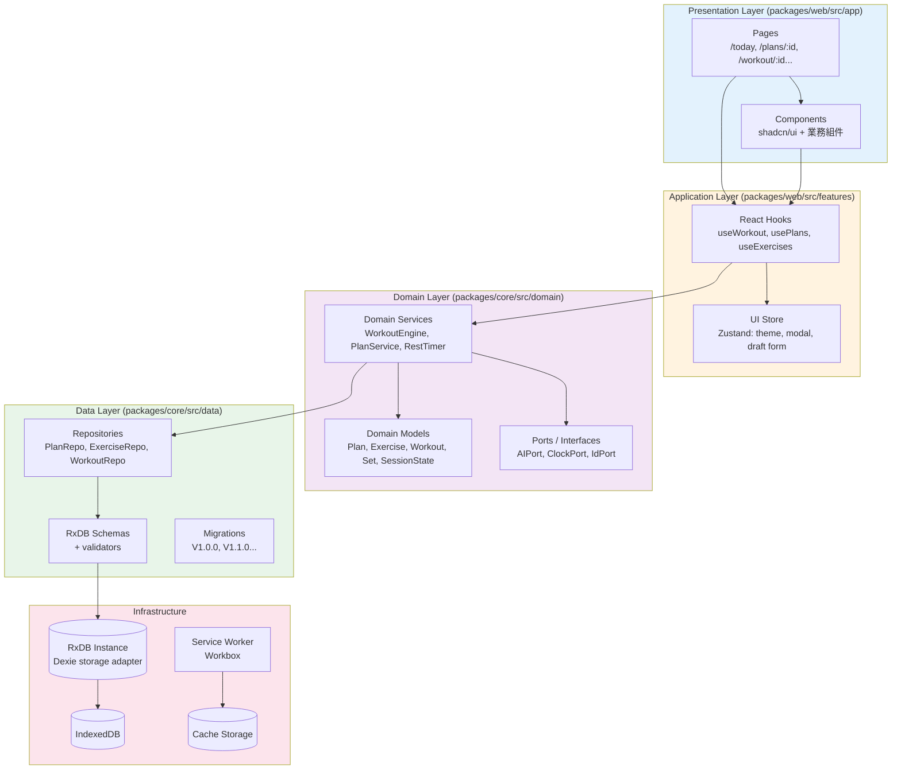
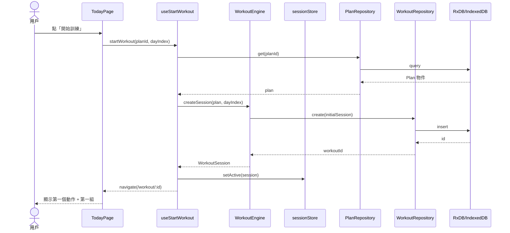
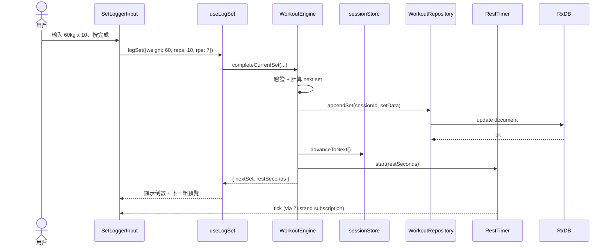
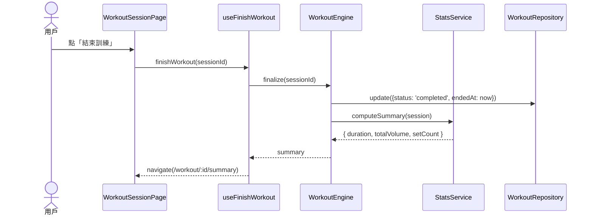
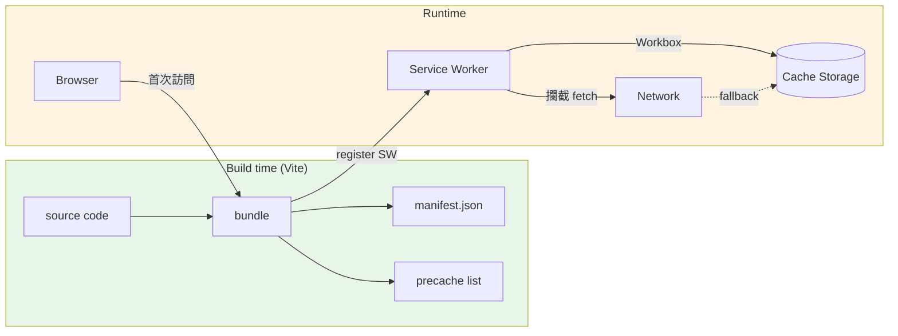
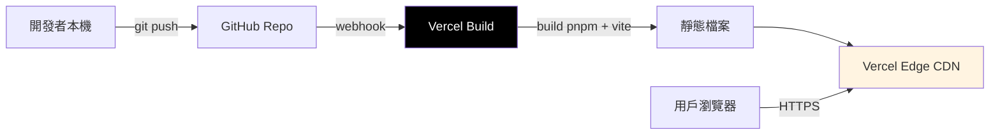

# 02 — 系統架構 (System Architecture)

> 本檔深入「**系統怎麼搭、層怎麼分、依賴怎麼流**」。配 [03-tech-stack.md](./03-tech-stack.md) (各層用什麼技術) 與 [09-monorepo-structure.md](./09-monorepo-structure.md) (檔案層級結構) 一起讀。

---

## 1. 架構心法 (Architectural Principles)

依優先序列出 V1 系統必須遵守的原則。**衝突時、上排優先**。

1. **業務邏輯與 UI 嚴格隔離**
   - `packages/core` 只能依賴標準 TypeScript / RxDB；不可 `import "react"`。
   - 這是 V2 React Native 共用業務邏輯的前提。
2. **Local-first，雲端為將來的「副本」而非真實**
   - 真實 = IndexedDB。雲端 (V2) 只是同步副本。
3. **每個畫面的「資料能力」靠 Repository、UI 只透過 hook 取用**
   - UI 不直接 `import RxDB`，而是 `useExercises()` / `usePlan(id)`。
4. **無第三方 runtime 依賴 (V1)**
   - 不接 Firebase / Sentry / GA。錯誤先存本地、設計上未來才導出。
5. **小依賴優先大框架**
   - Zustand 而非 Redux Toolkit；React Router 而非 Next.js；Tailwind 而非 MUI/Mantine。
6. **架構決策可逆**
   - 任何 ADR 都有「替代方案」記錄、替換成本評估在 [03-tech-stack.md](./03-tech-stack.md)。

---

## 2. 分層架構 (Layered Architecture)



### 2.1 依賴方向規則 (Dependency Rule)

> **箭頭只能從外層指向內層**。違反 = ESLint error (見 [11-testing-deployment.md](./11-testing-deployment.md))。

- Presentation 可依賴 Application、Domain、Data 的 **型別**，但執行邏輯只透過 Hooks。
- Application 可依賴 Domain、Data。
- Domain 不可依賴 Application 或 Presentation。
- Data 不可依賴 Domain 內部邏輯，只暴露介面。
- Infrastructure 是「被注入」的，不被任何業務層直接 import。

### 2.2 各層職責表

| 層             | 職責                                                            | 不能做                                  | 範例                                                  |
| -------------- | --------------------------------------------------------------- | --------------------------------------- | ----------------------------------------------------- |
| Presentation   | 渲染、路由、用戶輸入收集                                        | 不做業務規則、不直接訪問 RxDB           | `TodayPage`、`SetLoggerInput`                         |
| Application    | 編排 (orchestrate) UI 與 Domain、處理 UI-only 狀態              | 不做領域規則、不算數                    | `useStartWorkout()`、`useRestTimer()`、`uiStore`      |
| Domain         | 領域規則、計算、狀態機                                          | 不知道 React、不知道 RxDB 細節          | `WorkoutEngine.nextSet()`、`computeTotalVolume()`     |
| Data           | 資料模型、持久化、查詢                                          | 不做業務規則 (例如「下一組重量+2.5kg」) | `WorkoutRepo.findByDateRange()`                       |
| Infrastructure | 平台能力 (儲存、時間、亂數、SW)                                 | 不知道領域                              | RxDB instance、Web Crypto for `nanoid()`              |

---

## 3. C4 Level 3 — Component Diagram

放大 `React PWA` container 內部、看具體模組與檔案結構的對應。

```mermaid
graph TB
    subgraph WebApp["packages/web (React PWA)"]
        subgraph Pages["Pages /src/app"]
            P_Today["TodayPage<br/>/today"]
            P_Plans["PlansPage<br/>/plans"]
            P_PlanEdit["PlanEditorPage<br/>/plans/:id/edit"]
            P_Exercises["ExercisesPage<br/>/exercises"]
            P_ExerciseDetail["ExerciseDetailPage<br/>/exercises/:id"]
            P_Workout["WorkoutSessionPage<br/>/workout/:sessionId"]
            P_History["HistoryPage<br/>/history"]
            P_Settings["SettingsPage<br/>/settings"]
            P_Onboarding["OnboardingPages<br/>/onboard/*"]
        end

        subgraph Features["Features /src/features"]
            F_Workout["workout/<br/>useWorkout, RestTimer, SetLogger"]
            F_Plans["plans/<br/>usePlans, PlanCard, PlanEditor"]
            F_Exercises["exercises/<br/>useExercises, ExerciseCard, LottiePlayer"]
            F_History["history/<br/>useHistory, HistoryItem"]
            F_Onboarding["onboarding/<br/>useOnboarding, steps"]
            F_Settings["settings/<br/>useSettings"]
        end

        subgraph SharedUI["UI /src/ui"]
            U_Shadcn["shadcn primitives<br/>Button, Dialog, Input..."]
            U_Layout["layout/<br/>AppShell, BottomNav, Header"]
        end

        subgraph Stores["Stores /src/stores"]
            S_UI["uiStore (Zustand)<br/>theme, modal, draft"]
            S_Session["sessionStore (Zustand)<br/>當前 workout session 暫存"]
        end
    end

    subgraph Core["packages/core"]
        subgraph DomainSvc["domain/"]
            D_Engine["WorkoutEngine<br/>狀態機 + 規則"]
            D_Plan["PlanService"]
            D_Stats["StatsService"]
        end
        subgraph DataSvc["data/"]
            R_Plan["PlanRepository"]
            R_Ex["ExerciseRepository"]
            R_Workout["WorkoutRepository"]
            R_Settings["SettingsRepository"]
            DB["DatabaseFactory<br/>建立 RxDB instance"]
        end
        subgraph PortSvc["ports/"]
            Port_AI["AIPort<br/>V2 預留"]
            Port_Clock["ClockPort"]
            Port_Id["IdPort"]
        end
    end

    P_Today --> F_Workout
    P_Workout --> F_Workout
    P_Plans --> F_Plans
    P_PlanEdit --> F_Plans
    P_Exercises --> F_Exercises
    P_ExerciseDetail --> F_Exercises
    P_History --> F_History
    P_Settings --> F_Settings
    P_Onboarding --> F_Onboarding

    F_Workout --> S_Session
    F_Workout --> D_Engine
    F_Plans --> R_Plan
    F_Exercises --> R_Ex
    F_History --> R_Workout
    F_History --> D_Stats
    F_Settings --> R_Settings
    F_Onboarding --> R_Settings

    D_Engine --> Port_Clock
    D_Engine --> R_Workout
    D_Plan --> R_Plan
    D_Stats --> R_Workout

    R_Plan --> DB
    R_Ex --> DB
    R_Workout --> DB
    R_Settings --> DB

    style WebApp fill:#e3f2fd
    style Core fill:#fff4e1
    style Pages fill:#bbdefb
    style Features fill:#90caf9
```



詳見 [09-monorepo-structure.md](./09-monorepo-structure.md) 看實際資料夾配置。

---

## 4. 主要資料流 (Key Data Flows)

### 4.1 「開始今天的訓練」流程



### 4.2 「記錄一組」流程



### 4.3 「完成訓練」流程



---

## 5. 跨切關注點 (Cross-cutting Concerns)

### 5.1 時間 (Time)

- 所有「現在時間」**不從 `Date.now()` 直接取**。
- 注入 `ClockPort` → 預設實作是 `SystemClock`，測試用 `FakeClock`。
- 原因：休息倒數、訓練時長、訓練日期都需要時間，否則測試難寫、跨時區易出 bug。

```typescript
// packages/core/src/ports/ClockPort.ts
export interface ClockPort {
  now(): Date;
  monotonic(): number; // 用於倒數計時、避免系統時間跳動
}
```

### 5.2 ID 產生

- 所有實體 ID 不用 `Math.random()` 或時間戳。
- 注入 `IdPort` → 預設用 `nanoid()`。
- 原因：V2 cloud sync 需要 collision-resistant ID、且要可預測測試。

### 5.3 錯誤處理

- **Domain 錯誤**：使用 typed result (`Result<T, DomainError>`)，不 throw。
- **Infrastructure 錯誤** (例如 RxDB write 失敗)：throw，由 React Error Boundary 接住。
- **Service Worker 錯誤**：記錄到 IndexedDB 的 `errorLogs` collection (V1 不上傳)。

### 5.4 日誌 (Logging)

- 開發環境：`console.log` 開啟、prefix `[domain]` / `[ui]` / `[sw]`。
- 生產環境：預設關閉，可由 Settings 開「Debug 模式」開啟並寫入 IndexedDB。
- **V1 不接外部遙測**。隱私 > 觀測性，這是設計決定。

### 5.5 i18n

- 所有用戶可見文案經 `t('key')` 取得。
- V1 只有 `zh-TW` locale，但結構支援多語系。
- 用 `@lingui/react` 或 `i18next`，**待 [03-tech-stack.md](./03-tech-stack.md) 敲定**。

### 5.6 主題 (Theming)

- Tailwind 的 `dark:` 變體 + `next-themes` (React)，或自寫 `theme-context`。
- 預設「跟隨系統」、可在設定強制覆寫。
- 主題色 token 在 `tailwind.config.ts` 的 CSS variables 中定義、由設計系統 prompt 給出 (見 [20-claude-design-prompts.md](./20-claude-design-prompts.md) §1)。

---

## 6. 模組邊界與 Port (Hexagonal Architecture 影響)

V1 採用「**輕量六角架構**」：Domain 透過 Ports 與外部世界對話，外部世界提供 Adapter。

### 6.1 已定義的 Ports (V1)

| Port           | 用途                                                       | V1 Adapter           | V2 可換成                    |
| -------------- | ---------------------------------------------------------- | -------------------- | ---------------------------- |
| `ClockPort`    | 取得時間                                                   | `SystemClock`        | `FakeClock` (測試)            |
| `IdPort`       | 產生 ID                                                    | `NanoidIdGenerator`  | `UUIDGenerator` (V2 同步用)   |
| `StoragePort`  | 由 Repository 內部使用、抽象 IndexedDB                     | `RxDBStorage`        | `SupabaseStorage` (V2)        |
| `AIPort`       | 與 AI 教練對話、產生課表、即時建議                         | `NoopAIAdapter` (V1) | `ClaudeAIAdapter` (V2)        |
| `AnalyticsPort` | 事件追蹤                                                   | `NoopAnalytics` (V1) | `PostHogAdapter` (V2 可選)    |

詳見 [10-ai-extension-points.md](./10-ai-extension-points.md) 對 `AIPort` 的設計。

### 6.2 Port 注入機制

```typescript
// packages/core/src/container.ts
export function createCore(deps: {
  clock?: ClockPort;
  idGen?: IdPort;
  aiAdapter?: AIPort;
}) {
  const clock = deps.clock ?? new SystemClock();
  const idGen = deps.idGen ?? new NanoidIdGenerator();
  const ai = deps.aiAdapter ?? new NoopAIAdapter();

  const db = createDatabase();
  const planRepo = new PlanRepository(db);
  const workoutRepo = new WorkoutRepository(db);
  const engine = new WorkoutEngine({ clock, idGen, workoutRepo });
  // ...
  return { engine, planRepo, workoutRepo /* ... */ };
}
```

在 `packages/web` 的 `main.tsx`：
```typescript
const core = createCore({});
// 用 React Context 提供
```

---

## 7. PWA 架構 (簡介、詳見 08)



關鍵設定：
- **Precache**：App Shell (HTML + JS + CSS + 字型 + icon)
- **Runtime cache** — Lottie JSON：`StaleWhileRevalidate`、快取池 1 個月
- **離線 fallback**：所有 navigation 回到 `/offline.html` (或直接渲染 shell)

詳見 [08-pwa-offline.md](./08-pwa-offline.md)。

---

## 8. 部署架構 (V1)



- Vercel 免費方案足夠 (純靜態 + Edge CDN)
- `pnpm-lock.yaml` 鎖版本
- Build command: `pnpm --filter @fitforge/web build`
- Output: `packages/web/dist`

詳見 [11-testing-deployment.md](./11-testing-deployment.md)。

---

## 9. 安全性考量 (Security — V1 簡略)

V1 因為「全本地、無後端、無敏感資料」，安全壓力極低。但仍記錄：

| 風險                         | 緩解                                                                 |
| ---------------------------- | -------------------------------------------------------------------- |
| XSS                          | React 預設 escape；不用 `dangerouslySetInnerHTML`；CSP header        |
| 依賴漏洞 (npm)               | Dependabot + `pnpm audit` in CI                                      |
| Service Worker hijack        | 同源、Vercel HTTPS only                                              |
| 用戶資料離開裝置             | V1 完全不離開 (除了用戶主動匯出 JSON)                                 |
| CSP / Mixed content          | Vite 預設、Vercel HTTPS、無第三方 script                              |

V2 引入後端後安全章節需要大幅擴充，見 [12-roadmap-v2.md](./12-roadmap-v2.md) §6。

---

## 10. 可觀測性 (Observability — V1 極簡)

V1 不裝 Sentry / GA，但保留「以後加得進去」的勾子：

- `AnalyticsPort`：V1 是 noop、V2 可換 PostHog/Plausible (尊重隱私)
- 錯誤 boundary 記錄到 `errorLogs` IndexedDB collection、Settings 頁面可匯出
- Console log prefix 一致 (`[fitforge:domain]`、`[fitforge:ui]`、`[fitforge:sw]`) 利於 grep

---

## 11. 不變式 / 系統不變條件 (Invariants)

實作時務必守住的「事實上的合約」：

1. ✅ `packages/core` import 任何 `react*` package = 構建失敗 (在 CI 設 lint rule)
2. ✅ 每個 Repository 都有對應的 Schema、Schema 版本與 migration 一致
3. ✅ `WorkoutEngine` 對外只有 5 個入口 (start、logSet、skipSet、pauseRest、finish) — 不再多
4. ✅ 所有時間相關呼叫經 `ClockPort`、不能 `new Date()`
5. ✅ 所有 ID 產生經 `IdPort`、不能 `Math.random()` 或 `crypto.randomUUID()` 直接呼叫 (要透過 port)
6. ✅ 用戶輸入經 Zod schema 驗證後才入 store / DB

---

## 12. 下一步閱讀

- 想看每個技術為什麼選 → [03-tech-stack.md](./03-tech-stack.md)
- 想看資料模型細節 → [04-data-model.md](./04-data-model.md)
- 想看每個 Domain Service 內部規則 → [05-domain-logic.md](./05-domain-logic.md)
- 想看資料夾長怎樣 → [09-monorepo-structure.md](./09-monorepo-structure.md)
