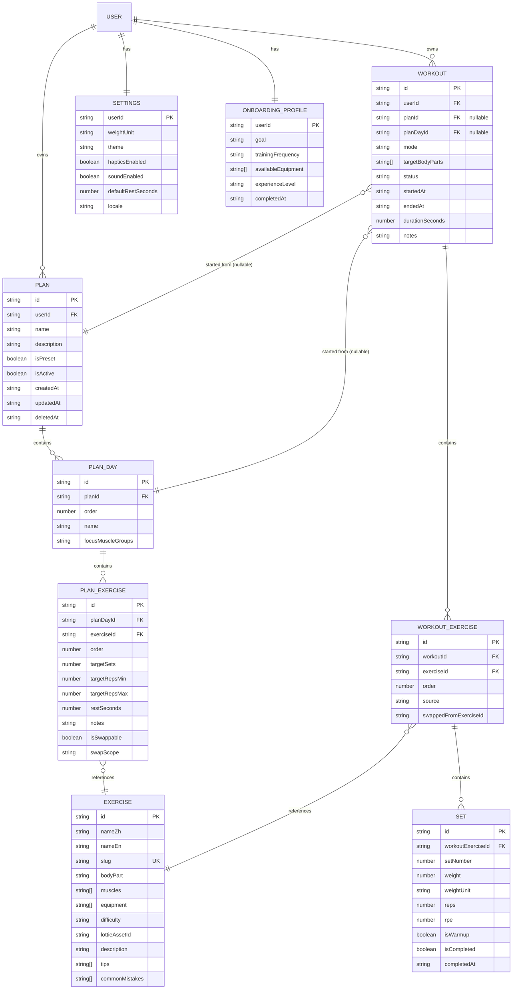

# 04 — 資料模型 (Data Model)

> 本檔定義所有 RxDB collection 的 schema、實體關係、索引策略、migration 步驟。是 V1 / V2 共用、寫進 `packages/core/src/data/schemas/`。

---

## 1. 設計原則

1. **每個 schema 含 `userId` 欄位** — V1 寫死 `"local"`，V2 接 cloud sync 時填真實 user id。
2. **時間欄位** — 統一用 ISO 8601 string (`createdAt`、`updatedAt`)，不存 timestamp 整數 (利於 debug & 同步協議友善)。
3. **ID** — `nanoid()` 21 字、加前綴 (`plan_xxx`、`ex_xxx`、`wo_xxx`) 利於 grep / debug。
4. **軟刪除** — `deletedAt: string | null`，預設 query 過濾掉。V2 同步友善。
5. **版本控制** — 每個 schema 有 `version: 0` 起跳、migration 函式 in `packages/core/src/data/migrations/`。
6. **可序列化** — 所有欄位是 JSON 可表達的 (string / number / boolean / array / object)，不存 Date 物件、不存 functions。

---

## 2. 實體關係圖 (ER Diagram)



---

## 3. Collection Schemas (RxDB JSON Schema)

> 完整 schema 寫在 `packages/core/src/data/schemas/*.schema.ts`，以下為精華節錄。**所有 schema 文件最終以 Zod schema 為單一真相**，RxDB JSON Schema 由 Zod 衍生。

### 3.1 `exercises` Collection

**用途**：靜態動作資料庫，30 個 MVP 動作預先 seed 入。Tag 兩層設計、完整列表見 [13-exercise-tagging.md](./13-exercise-tagging.md)。

```typescript
// packages/core/src/data/schemas/exercise.schema.ts
import { z } from 'zod';
import { BODY_PARTS, MUSCLES } from './tags';

export const ExerciseSchema = z.object({
  id: z.string().regex(/^ex_/),
  slug: z.string().min(1).max(64), // unique
  nameZh: z.string().min(1).max(64),
  nameEn: z.string().min(1).max(64),
  // === Tag 系統 (見 13-exercise-tagging.md) ===
  bodyPart: z.enum(BODY_PARTS), // 1 個大分類
  muscles: z.array(z.enum(MUSCLES)).min(1).max(6), // 1-6 個細分肌群、第一個是主肌群
  // === 其他屬性 ===
  equipment: z.array(z.enum([
    'barbell', 'dumbbell', 'machine', 'cable',
    'bodyweight', 'kettlebell', 'band', 'bench'
  ])),
  difficulty: z.enum(['beginner', 'intermediate', 'advanced']),
  isUnilateral: z.boolean().default(false), // 單邊動作 (Bulgarian Split Squat 類)
  lottieAssetId: z.string(), // 對應 /assets/lottie/{id}.json
  description: z.string(),   // 1-2 句動作說明
  steps: z.array(z.string()).max(6), // 步驟拆解
  tips: z.array(z.string()).max(5),  // 注意事項
  commonMistakes: z.array(z.string()).max(5),
  videoUrl: z.string().url().optional(), // V2 可選備援
  isPreset: z.literal(true), // 全部預設、V1 用戶不能新增動作 (V2 開放)
  createdAt: z.string().datetime(),
  updatedAt: z.string().datetime(),
}).refine(
  (data) => data.muscles.every((m) => MUSCLE_TO_BODY_PART[m] === data.bodyPart || data.bodyPart === 'full_body'),
  { message: 'muscles 必須對應 bodyPart 或 bodyPart 為 full_body' }
);

export type Exercise = z.infer<typeof ExerciseSchema>;
```

**索引**：
- Primary key: `id`
- Secondary: `slug` (unique)、`bodyPart`、`muscles[]` (search)、`equipment[]` (filter)、`difficulty`

**Schema version**: 0

**Tag 完整列表**：見 [13-exercise-tagging.md](./13-exercise-tagging.md)。重點：
- `bodyPart` 7 個：`chest`、`back`、`shoulders`、`arms`、`legs`、`core`、`full_body`
- `muscles` 21 個 (細分肌群)：例 `front_delts`、`lateral_delts`、`rear_delts`、`upper_chest`、`lats` 等
- **慣例**：`muscles[0]` 是主肌群、之後是輔助

---

### 3.2 `plans` Collection

**用途**：訓練計劃 (預設 + 自訂)。

```typescript
export const PlanSchema = z.object({
  id: z.string().regex(/^plan_/),
  userId: z.string().default('local'),
  name: z.string().min(1).max(60),
  description: z.string().max(280),
  isPreset: z.boolean(), // V1 種 3 個 preset
  isActive: z.boolean(), // 用戶設為「目前正在跑」的計劃
  goalTag: z.enum(['strength', 'hypertrophy', 'general', 'fatloss']).optional(),
  frequencyPerWeek: z.number().int().min(1).max(7),
  days: z.array(PlanDaySchema), // 內嵌、避免額外 collection
  createdAt: z.string().datetime(),
  updatedAt: z.string().datetime(),
  deletedAt: z.string().datetime().nullable().default(null),
});

export const PlanDaySchema = z.object({
  id: z.string().regex(/^pd_/),
  order: z.number().int(),
  name: z.string().min(1).max(40),
  focusMuscleGroups: z.array(z.string()),
  exercises: z.array(PlanExerciseSchema),
});

export const PlanExerciseSchema = z.object({
  id: z.string().regex(/^pe_/),
  exerciseId: z.string().regex(/^ex_/),
  order: z.number().int(),
  targetSets: z.number().int().min(1).max(20),
  targetRepsMin: z.number().int().min(1).max(100),
  targetRepsMax: z.number().int().min(1).max(100),
  restSeconds: z.number().int().min(0).max(600).default(90),
  notes: z.string().max(200).optional(),
  // === 訓練中換動作能力 (見 13-exercise-tagging.md §9) ===
  isSwappable: z.boolean().default(true), // 允許訓練中替換成同類動作
  swapScope: z.enum(['same_muscle', 'same_body_part', 'any']).default('same_muscle'),
  // same_muscle: 限同主肌群替換 (推薦)
  // same_body_part: 同大分類即可
  // any: 不限 (謹慎)
});

export type Plan = z.infer<typeof PlanSchema>;
```

**慣例**：
- 預設 `isSwappable: true`、`swapScope: 'same_muscle'`
- 「關鍵安全動作」(例：Deadlift、Squat) 在 seed 中設為 `isSwappable: false`、防止新手亂換
- 預設課表的「主動作」(每日第一個) 通常設為 `swapScope: 'same_body_part'`、給予彈性

**設計決定**：
- `PlanDay` 與 `PlanExercise` **內嵌** (而非另開 collection) — Plan 的子結構很穩定、查詢都是「整個 plan 一起拿」、無 N+1 query 風險。
- 預設 plan `isPreset: true` 由 seed 函式種入；用戶 fork 後變成 `isPreset: false`。

**索引**：`userId`、`isActive`、`isPreset`、`deletedAt`

**Schema version**: 0

---

### 3.3 `workouts` Collection

**用途**：實際訓練紀錄。

```typescript
export const WorkoutSchema = z.object({
  id: z.string().regex(/^wo_/),
  userId: z.string().default('local'),
  planId: z.string().regex(/^plan_/).nullable(), // 從計劃啟動則填、自由訓練則 null
  planDayId: z.string().regex(/^pd_/).nullable(),
  // === 啟動模式 (V1 新增) ===
  mode: z.enum(['from_plan', 'ad_hoc']).default('from_plan'),
  // from_plan: 從 Plan 啟動、planId/planDayId 必填
  // ad_hoc:   自由訓練、planId/planDayId 為 null
  targetBodyParts: z.array(z.enum(BODY_PARTS)).default([]),
  // ad-hoc 模式時用戶選的目標部位；from_plan 模式可為空
  // === 其他 ===
  name: z.string().max(60), // copy 自 planDay.name 或 用戶輸入 (ad-hoc: 「胸 + 三頭」)
  status: z.enum(['in_progress', 'completed', 'abandoned']),
  startedAt: z.string().datetime(),
  endedAt: z.string().datetime().nullable(),
  durationSeconds: z.number().int().nullable(),
  exercises: z.array(WorkoutExerciseSchema), // 內嵌
  notes: z.string().max(500).default(''),
  createdAt: z.string().datetime(),
  updatedAt: z.string().datetime(),
  deletedAt: z.string().datetime().nullable().default(null),
});

export const WorkoutExerciseSchema = z.object({
  id: z.string().regex(/^we_/),
  exerciseId: z.string().regex(/^ex_/),
  order: z.number().int(),
  sets: z.array(SetSchema),
  notes: z.string().max(200).default(''),
  // === 訓練中變更的紀錄 (V1 新增) ===
  source: z.enum(['from_plan', 'added_during_session', 'swapped', 'ad_hoc_initial']).default('from_plan'),
  // from_plan:                  Pre-Workout 從 plan 拷貝、未動過
  // added_during_session:        訓練前/中加進來的 (Pre-Workout 加 / Session 加都算)
  // swapped:                    從 plan 中的動作 swap 過來、見 swappedFromExerciseId
  // ad_hoc_initial:             ad-hoc workout 開始時挑的初始動作
  swappedFromExerciseId: z.string().regex(/^ex_/).nullable().default(null),
});

export const SetSchema = z.object({
  id: z.string().regex(/^set_/),
  setNumber: z.number().int().min(1),
  weight: z.number().min(0).max(1000),
  weightUnit: z.enum(['kg', 'lb']),
  reps: z.number().int().min(0).max(100),
  rpe: z.number().min(1).max(10).optional(), // 1–10 自感強度、選填
  isWarmup: z.boolean().default(false),
  isCompleted: z.boolean().default(false),
  completedAt: z.string().datetime().nullable(),
});

export type Workout = z.infer<typeof WorkoutSchema>;
```

**索引**：`userId`、`startedAt` (descending、用於歷史列表)、`status`、`deletedAt`

**Schema version**: 0

---

### 3.4 `settings` Collection (單一文件)

**用途**：用戶偏好。

```typescript
export const SettingsSchema = z.object({
  userId: z.string().default('local'), // primary key
  weightUnit: z.enum(['kg', 'lb']).default('kg'),
  theme: z.enum(['system', 'light', 'dark']).default('system'),
  hapticsEnabled: z.boolean().default(true),
  soundEnabled: z.boolean().default(true),
  defaultRestSeconds: z.number().int().min(0).max(600).default(90),
  locale: z.enum(['zh-TW']).default('zh-TW'), // V2 加 'en' 等
  onboardingCompleted: z.boolean().default(false),
  installPromptShownCount: z.number().int().default(0),
  createdAt: z.string().datetime(),
  updatedAt: z.string().datetime(),
});

export type Settings = z.infer<typeof SettingsSchema>;
```

**Schema version**: 0

---

### 3.5 `onboardingProfiles` Collection (單一文件)

**用途**：onboarding 蒐集到的用戶 profile。

```typescript
export const OnboardingProfileSchema = z.object({
  userId: z.string().default('local'),
  goal: z.enum(['strength', 'hypertrophy', 'general_fitness', 'fatloss']),
  trainingFrequency: z.enum(['2', '3', '4', '5', '6']), // 一週幾次
  availableEquipment: z.array(z.enum([
    'home_no_equipment',
    'home_dumbbells',
    'gym_full',
    'gym_machines_only'
  ])),
  experienceLevel: z.enum(['absolute_beginner', 'novice', 'intermediate']),
  ageRange: z.enum(['<20', '20-30', '30-40', '40-50', '>50']).optional(),
  completedAt: z.string().datetime(),
});
```

**Schema version**: 0

---

### 3.6 (V2 預留) `measurements`、`syncMeta`、`aiSessions`

V1 **不創建**，但在 [12-roadmap-v2.md](./12-roadmap-v2.md) §3 列出 schema 草稿，避免 V2 時來不及思考。

---

## 4. 索引策略 (Index Strategy)

| Collection | 索引欄位                          | 用途                                                  |
| ---------- | --------------------------------- | ----------------------------------------------------- |
| exercises  | `slug`、`bodyPart`、`muscles[]`、`equipment[]`、`difficulty` | 搜尋、篩選、換動作演算法 |
| plans      | `userId`、`isActive`、`isPreset`、`deletedAt` | 列表、過濾預設 vs 自訂                            |
| workouts   | `userId`、`startedAt`、`status`、`mode`、`deletedAt` | 歷史列表 (按時間)、in-progress 重整、依模式統計 |
| settings   | `userId` (primary)                | 單文件查詢                                             |

> RxDB 的 IndexedDB adapter 支援複合索引、但 V1 用不到。V2 cloud sync 評估時再加。

---

## 5. 種子資料 (Seed Data)

V1 啟動時若資料庫為空，由 `packages/core/src/data/seed.ts` 種入：

### 5.1 30 個動作 (見 `seeds/exercises.ts`)

依肌群分組：
- **下半身** (6)：Back Squat、Front Squat、Romanian Deadlift、Bulgarian Split Squat、Leg Press、Goblet Squat
- **胸** (4)：Bench Press、Incline DB Press、Push-up、Chest Fly (cable/db)
- **背** (5)：Deadlift、Bent-over Row、Lat Pulldown、Pull-up、Seated Cable Row
- **肩** (3)：Overhead Press、Lateral Raise、Face Pull
- **手臂** (3)：Barbell Curl、Triceps Pushdown、Hammer Curl
- **核心** (3)：Plank、Hanging Knee Raise、Russian Twist
- **臀** (2)：Hip Thrust、Glute Bridge
- **臂** (1)：Farmer's Carry (forearms + grip + core)
- **腿 (補)** (1)：Calf Raise
- **背 (補)** (1)：Renegade Row
- **混合** (1)：Kettlebell Swing

> 上面數字加起來 **30** ✓。

每個動作的 Lottie asset 對應 `/public/assets/lottie/{slug}.json`。V1 初期可用佔位 (例如 `placeholder.json`)、之後替換。

### 5.2 3 套預設 Plan (見 `seeds/plans.ts`)

#### Plan 1: **新手全身入門 A/B** (Beginner Full Body)
- 一週 3 次、每次 45 分
- 兩天交替 (A/B)
- Day A: Back Squat 3x8、Bench Press 3x8、Bent-over Row 3x8、Plank 3x30s
- Day B: Romanian Deadlift 3x8、Overhead Press 3x8、Lat Pulldown 3x8、Hanging Knee Raise 3x10

#### Plan 2: **上下分化** (Upper / Lower)
- 一週 4 次、每次 45 分
- Upper Day: Bench、Bent-over Row、OHP、Lat Pulldown、Lateral Raise、Triceps Pushdown
- Lower Day: Back Squat、Romanian Deadlift、Bulgarian Split Squat、Hip Thrust、Calf Raise

#### Plan 3: **推拉腿** (Push / Pull / Legs)
- 一週 3–6 次、每次 60 分
- Push: Bench、Incline DB、OHP、Lateral Raise、Triceps Pushdown
- Pull: Deadlift、Pull-up、Bent-over Row、Face Pull、Barbell Curl
- Legs: Back Squat、Romanian Deadlift、Hip Thrust、Calf Raise、Plank

> Plan 的具體欄位、組數、休息秒數見 `seeds/plans.ts` 完整定義 (本檔不重複)。

---

## 6. Migration 策略

### 6.1 版本進化原則
- 每個 schema 有 `version` 號、從 0 起跳。
- 新增非必填欄位：bump version、寫 migrate fn 把舊文件補上預設值。
- 改 enum 或刪欄位：更危險，需謹慎。

### 6.2 範例 (假設 V1.1 加 `Workout.locationTag`)

```typescript
// packages/core/src/data/migrations/workout.v1.ts
export const workoutMigrations = {
  // version 0 → 1
  1: (oldDoc: any) => ({
    ...oldDoc,
    locationTag: null, // 新欄位、預設 null
  }),
};
```

在 `WorkoutCollection.addCollections({ ... migrationStrategies: workoutMigrations })` 註冊。

### 6.3 不變數 — 一旦 schema v0 推到 production
- 不允許「破壞性 schema 修改」(刪欄位、改 type)，只能 deprecate
- 必須先寫 migration、再 ship 新 schema
- V2 cloud sync 上線後、本地 schema 與 cloud schema 要保持版本對映

---

## 7. 容量與性能

| 項目                    | 預估                                              |
| ----------------------- | ------------------------------------------------- |
| 30 個 exercise (含 seed) | < 50 KB                                           |
| 100 個 workout / 年      | < 200 KB                                          |
| 用戶完整資料量 (1 年)    | < 500 KB                                          |
| Lottie 動畫 (30 個)      | 30 × 50 KB ≈ 1.5 MB (Cache Storage 而非 IDB)       |
| IndexedDB quota         | 至少 50 MB / origin (現代瀏覽器)、實際遠不到上限    |

---

## 8. 資料完整性 / 一致性規則

> RxDB 沒有 cross-collection 的 referential integrity。下列規則由 **Domain Service** 強制：

| 規則                                                        | Enforced by                |
| ----------------------------------------------------------- | -------------------------- |
| `Workout.planId` 必須對應存在的 `plans.id` 或 null          | `WorkoutEngine.start()`    |
| `WorkoutExercise.exerciseId` 必須存在於 `exercises`         | `WorkoutEngine.addExercise` |
| 軟刪除的 Plan 不能再被 Workout 引用                          | `WorkoutEngine.start()`    |
| `Set.setNumber` 在同一 `WorkoutExercise` 內連續、從 1 起    | `WorkoutEngine.logSet()`   |
| `Workout.status === 'completed'` 後不能再 logSet            | `WorkoutEngine.logSet()` guard |
| `Workout.mode === 'from_plan'` 必須有 `planId` 與 `planDayId` | `WorkoutEngine.start()`  |
| `Workout.mode === 'ad_hoc'` 必須有 `targetBodyParts.length >= 1` | `WorkoutBuilderService.start()` |
| `PlanExercise.isSwappable === false` 時、`swapExercise` 拒絕 | `WorkoutEngine.swapExercise()` |
| swap 目標必須符合 `swapScope` 限制 (見 13-exercise-tagging.md §9) | `ExerciseQueryService.findSubstitutes()` |
| `WorkoutExercise.muscles` 對應的 `exercise.bodyPart` 與 `bodyPart` 一致 | Zod refinement |

詳見 [05-domain-logic.md](./05-domain-logic.md)。

---

## 9. 資料匯出 / 匯入

V1 設定頁面提供「匯出 JSON」、「匯入 JSON」：

```typescript
type ExportPayload = {
  schemaVersion: 1;
  exportedAt: string;
  plans: Plan[];
  workouts: Workout[];
  settings: Settings;
  onboardingProfile: OnboardingProfile | null;
  // exercises 不含 — 由種子重建
};
```

- 匯出：JSON.stringify → 觸發 `<a download="fitforge-export-YYYYMMDD.json">`
- 匯入：解析 → schema 驗證 (Zod) → wipe + insert → 提示用戶重啟

---

## 10. 下一步閱讀

- 想看資料如何被使用 (Domain Service 對 schema 的依賴) → [05-domain-logic.md](./05-domain-logic.md)
- 想看 Repository 介面 → [09-monorepo-structure.md](./09-monorepo-structure.md) §3
- 想看 V2 schema (cloud sync 後) → [12-roadmap-v2.md](./12-roadmap-v2.md) §3
