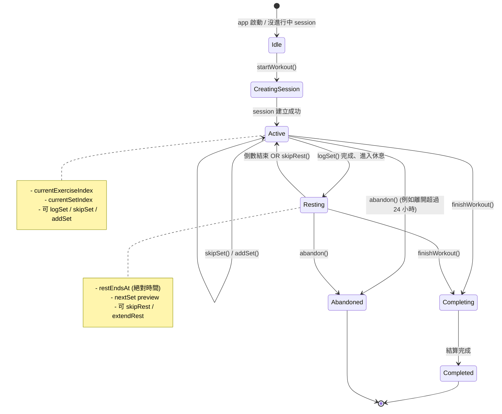
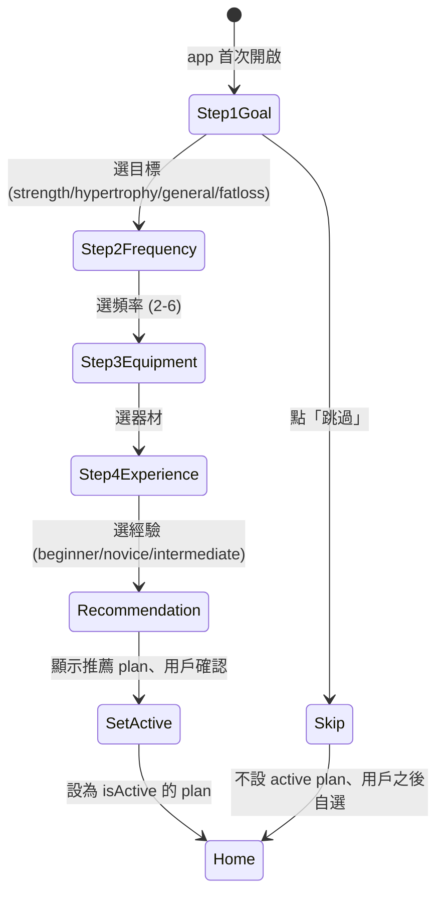

# 05 — 領域邏輯 (Domain Logic)

> 本檔定義 `packages/core/src/domain/` 內每個 Service 的職責、介面、不變式、狀態機。對應 [04-data-model.md](./04-data-model.md) 的 schema 是「資料」、本檔是「行為」。

---

## 1. Domain Service 一覽

| Service                  | 職責                                              | 主要消費者                 |
| ------------------------ | ------------------------------------------------- | -------------------------- |
| `WorkoutEngine`          | 訓練 session 狀態機、紀錄、組間休息推進、加減換動作、結束結算 | `useWorkout` hook、`WorkoutSessionPage` |
| `WorkoutBuilderService`  | 啟動 workout 前的「組菜單」邏輯 (from_plan 微調 / ad_hoc 建立) | `usePreWorkout`、`useAdhocBuilder` |
| `ExerciseQueryService`   | 依 tag 查詢動作、找替代動作、智慧推薦              | Swap Sheet、Ad-hoc Builder、Exercise Library |
| `PlanService`            | 計劃 CRUD、預設 plan 種入、複製為自訂 plan        | `usePlans`、`PlanEditor`   |
| `StatsService`           | 訓練摘要、總噸位、PR (個人紀錄)、簡易進度         | `useWorkoutSummary`、`useHistory` |
| `OnboardingService`      | onboarding 步驟編排、profile 寫入 + 推薦 plan    | `useOnboarding`            |
| `SeedService`            | 首次啟動種入 30 個 exercise + 3 個預設 plan       | App bootstrap              |
| `ExportService`          | 匯出 / 匯入 JSON                                  | `useDataExport`、設定頁    |
| `RestTimer`              | 訓練中組間倒數 (Domain 層的「時間機器」)          | `WorkoutEngine`、UI 訂閱   |

---

## 2. `WorkoutEngine` (核心)

### 2.1 職責
是 V1 最重要的 service。負責一整次訓練的狀態與規則：
- 啟動 session
- 紀錄一組 (含驗證、自動推進到下一組)
- 跳過 / 加組
- 暫停 / 繼續休息
- 結束訓練 (含結算)

### 2.2 狀態機



**不變式**：
- `status === 'completed'` 或 `'abandoned'` 的 session 不可再修改 (set 不可追加、不可刪除)
- 同一 user 同時只能有一個 `status === 'in_progress'` 的 workout (進入新 workout 前舊的需 abandon 或 complete)
- `currentSetIndex` 永遠在當前 exercise 的有效範圍內 (`0..targetSets-1`)，超出時觸發「動作完成、進入下一動作」
- `removeExercise` 拒絕：該 exercise 已有任何 `set.isCompleted === true`、避免摧毀紀錄
- `swapExercise` 拒絕：原 plan 的 `PlanExercise.isSwappable === false` (從 plan 帶來的限制要尊重)
- `swapExercise` 必須驗證：新動作符合 `swapScope` 限制 (見 [13-exercise-tagging.md](./13-exercise-tagging.md) §9)
- `addExercise` 新加的動作 `source` 自動設為 `'added_during_session'`

### 2.3 介面 (TypeScript)

```typescript
// packages/core/src/domain/WorkoutEngine.ts
export interface WorkoutEngineDeps {
  clock: ClockPort;
  idGen: IdPort;
  workoutRepo: WorkoutRepository;
  planRepo: PlanRepository;
  exerciseRepo: ExerciseRepository;
}

export type WorkoutEngineState =
  | { kind: 'idle' }
  | { kind: 'active'; workoutId: string; currentExerciseIndex: number; currentSetIndex: number }
  | { kind: 'resting'; workoutId: string; restEndsAt: string; nextSetPreview: SetPreview }
  | { kind: 'completed'; workoutId: string; summary: WorkoutSummary }
  | { kind: 'abandoned'; workoutId: string };

export class WorkoutEngine {
  constructor(private deps: WorkoutEngineDeps) {}

  // === 啟動 (兩個入口) ===

  /** 從計劃啟動新訓練 (走 WorkoutBuilderService.buildFromPlan) */
  start(input: { planId: string; planDayId: string; exercises: WorkoutExerciseDraft[] }): Promise<Result<Workout, DomainError>>;

  /** 從 ad-hoc builder 啟動 (走 WorkoutBuilderService.buildAdHoc) */
  startAdHoc(input: { targetBodyParts: BodyPart[]; exercises: WorkoutExerciseDraft[]; name?: string }): Promise<Result<Workout, DomainError>>;

  // === 訓練中：每組 ===

  /** 紀錄一組、並推進到下一組 + 開始休息 */
  logSet(input: { workoutId: string; weight: number; reps: number; rpe?: number }): Promise<Result<{ nextSet: SetPreview | null; restSeconds: number }, DomainError>>;

  /** 跳過當前組 */
  skipSet(workoutId: string): Promise<Result<void, DomainError>>;

  // === 訓練中：動態增減換動作 (V1 新增) ===

  /** 訓練中加一個動作到末尾或指定位置 */
  addExercise(input: { workoutId: string; exerciseId: string; atIndex?: number; targetSets?: number; targetRepsMin?: number; targetRepsMax?: number; restSeconds?: number }): Promise<Result<WorkoutExercise, DomainError>>;

  /** 移除一個還沒做的動作 (已有 set logged 的不能移、保留資料完整性) */
  removeExercise(input: { workoutId: string; workoutExerciseId: string }): Promise<Result<void, DomainError>>;

  /** 換成另一個動作 (保留 targetSets/reps/rest 設定、source=swapped) */
  swapExercise(input: { workoutId: string; workoutExerciseId: string; newExerciseId: string }): Promise<Result<WorkoutExercise, DomainError>>;

  // === 結束 ===

  /** 結束訓練 */
  finish(workoutId: string): Promise<Result<WorkoutSummary, DomainError>>;

  // === Query (不算「行為」、純讀) ===

  getState(workoutId: string): Promise<WorkoutEngineState>;
}

export type WorkoutExerciseDraft = {
  exerciseId: string;
  targetSets: number;
  targetRepsMin: number;
  targetRepsMax: number;
  restSeconds: number;
  source: 'from_plan' | 'added_during_session' | 'swapped' | 'ad_hoc_initial';
  swappedFromExerciseId?: string;
};
```

### 2.4 主要邏輯細節

#### `start(planId, planDayId)`
1. 取 plan、驗證 `deletedAt === null`
2. 從 `plan.days[].exercises` 建立 `Workout.exercises[]` (深拷貝、含每個 set 的初始 placeholder)
3. 寫入 `workouts` collection、`status: 'in_progress'`
4. 回傳 workout

```typescript
// 偽碼
async function start({ planId, planDayId }) {
  const plan = await planRepo.get(planId);
  if (!plan || plan.deletedAt) return Err('PLAN_NOT_FOUND');
  const day = plan.days.find(d => d.id === planDayId);
  if (!day) return Err('PLAN_DAY_NOT_FOUND');

  const exercises = day.exercises.map((pe, i) => ({
    id: idGen.next('we'),
    exerciseId: pe.exerciseId,
    order: i,
    sets: Array.from({ length: pe.targetSets }, (_, j) => ({
      id: idGen.next('set'),
      setNumber: j + 1,
      weight: 0,
      weightUnit: 'kg',  // 從 settings 取
      reps: 0,
      isWarmup: false,
      isCompleted: false,
      completedAt: null,
    })),
    notes: '',
  }));

  const workout: Workout = {
    id: idGen.next('wo'),
    userId: 'local',
    planId, planDayId,
    name: day.name,
    status: 'in_progress',
    startedAt: clock.now().toISOString(),
    endedAt: null,
    durationSeconds: null,
    exercises,
    notes: '',
    createdAt: clock.now().toISOString(),
    updatedAt: clock.now().toISOString(),
    deletedAt: null,
  };
  await workoutRepo.create(workout);
  return Ok(workout);
}
```

#### `logSet(workoutId, weight, reps, rpe?)`
1. 取 workout、驗證 `status === 'in_progress'`
2. 找出 currentSet (依 `isCompleted: false` 的第一個 set 找)
3. 更新該 set：`weight`、`reps`、`rpe`、`isCompleted: true`、`completedAt: now`
4. 寫回 DB
5. 計算下一組 preview (可能是同 exercise 的下一組、或下個 exercise 的第一組、或全部完成 → return null)
6. 回傳 `{ nextSet, restSeconds }` (取自 `PlanExercise.restSeconds` 或 settings default)

**邊界情況**：
- 全部組做完 → `nextSet: null`，UI 顯示「結束訓練」按鈕
- 用戶輸入 `reps: 0` → 視為「失敗組」、仍記錄 (RPE 可協助標註)
- 用戶輸入 `weight: 0` 且 `reps: 0` → 拒絕、回 `INVALID_SET`

#### `skipSet(workoutId)`
- 標記當前 set 為 `isCompleted: true` 但 `weight/reps/rpe` 不變
- 加個 `isSkipped: true` flag? **不**、用 `weight === 0 && reps === 0` 推斷即可，避免 schema 膨脹

#### `finish(workoutId)`
1. 計算 `endedAt` = now、`durationSeconds = endedAt - startedAt`
2. `status: 'completed'`
3. 呼叫 `StatsService.computeSummary(workout)` 取摘要
4. 回傳 summary

#### `abandon(workoutId)` (內部、不對外)
- 由 bootstrap 邏輯呼叫：若有 `in_progress` workout 且 `startedAt` 超過 24h，自動 abandon
- `status: 'abandoned'`、保留資料但不顯示在「進行中」

---

## 3. `PlanService`

### 3.1 介面

```typescript
export class PlanService {
  constructor(private deps: { planRepo: PlanRepository; exerciseRepo: ExerciseRepository; idGen: IdPort; clock: ClockPort }) {}

  listPresets(): Promise<Plan[]>;
  listUserPlans(): Promise<Plan[]>;
  get(planId: string): Promise<Plan | null>;
  setActive(planId: string): Promise<void>; // 取消其他 active、設定這個
  createBlank(name: string): Promise<Plan>;
  forkFromPreset(presetId: string): Promise<Plan>; // 複製預設、變成可編輯的自訂
  update(planId: string, patch: Partial<Plan>): Promise<Plan>;
  delete(planId: string): Promise<void>; // 軟刪除
  validate(plan: PlanDraft): Result<void, ValidationError>;
}
```

### 3.2 規則
- 預設 plan **不可直接編輯**、用戶要編輯必須先 `fork`
- 每個 user 同時最多 1 個 `isActive: true` plan — service 強制 (set 新 active 時自動 unset 其他)
- 自訂 plan 至少 1 個 day、每個 day 至少 1 個 exercise (否則 `validate` 失敗)

---

## 4. `StatsService`

### 4.1 介面

```typescript
export class StatsService {
  constructor(private deps: { workoutRepo: WorkoutRepository }) {}

  computeSummary(workout: Workout): WorkoutSummary;
  getRecentWorkouts(limit: number): Promise<Workout[]>;
  getPRsForExercise(exerciseId: string): Promise<PRRecord[]>;
  getWeeklyVolume(weeks: number): Promise<WeeklyVolumePoint[]>;
}

export type WorkoutSummary = {
  workoutId: string;
  durationSeconds: number;
  totalSets: number;
  completedSets: number;
  totalVolume: number; // sum of weight * reps，weight 統一換成 kg
  totalVolumeUnit: 'kg';
  exerciseCount: number;
  prs: PRRecord[]; // 本次新增的 PR
};

export type PRRecord = {
  exerciseId: string;
  exerciseName: string;
  type: '1RM_estimate' | 'volume_per_set' | 'reps_at_weight';
  value: number;
  achievedAt: string;
};
```

### 4.2 PR (個人紀錄) 邏輯

V1 簡單版 — 只記三種 PR：

1. **估算 1RM**：用 Epley formula `1RM ≈ weight × (1 + reps / 30)`、取本動作所有 set 中最大值。
2. **單組最大噸位**：`max(weight × reps)` per exercise。
3. **特定重量最高次數**：對「常見重量區段」(例如 60kg) 記錄最高次數。

當 `logSet` 後若新成績超越過往、標記 PR (顯示徽章鼓勵新手)。

> **V1 不做**：訓練量曲線、每日肌群分布圖 — 屬於量化進度模組、V2 加。

---

## 5. `OnboardingService`

### 5.1 流程



### 5.2 推薦邏輯 (簡易決策樹)

| 目標 + 經驗 + 頻率                          | 推薦 Plan                |
| ------------------------------------------- | ------------------------ |
| beginner / novice + 任何目標 + 2-3 次       | Beginner Full Body A/B   |
| novice / intermediate + 任何目標 + 4 次     | Upper / Lower            |
| intermediate + 肌肥大 / 力量 + 3-6 次       | Push / Pull / Legs       |
| 其他組合                                     | Beginner Full Body A/B (fallback) |

> V2 加入 AI 後、推薦由 `AIPort.recommendPlan(profile)` 接手、本表 fallback 仍保留。

---

## 6. `SeedService`

### 6.1 介面

```typescript
export class SeedService {
  constructor(private deps: { exerciseRepo: ExerciseRepository; planRepo: PlanRepository; settingsRepo: SettingsRepository; clock: ClockPort }) {}

  async ensureSeeded(): Promise<{ seededExercises: boolean; seededPlans: boolean; seededSettings: boolean }>;
}
```

### 6.2 規則
- App bootstrap (在 `packages/web/src/main.tsx` 載入 RxDB 後立刻呼叫)
- 若 `exercises` collection 為空 → 種入 30 個 exercise
- 若 `plans` 中無 `isPreset: true` 文件 → 種入 3 個預設 plan
- 若 `settings` 無文件 → 寫入預設 settings
- **冪等**：重複執行不會重複種入

---

## 7. `RestTimer` (Domain 層計時)

訓練中組間倒數的真相源是 **Domain 層**、不是 UI。理由：
- UI 重整 / 切頁面、計時不能丟
- V2 RN 時行為一致
- 測試可注入 `FakeClock` 加速

### 7.1 介面

```typescript
export class RestTimer {
  constructor(private clock: ClockPort) {}

  /** 啟動倒數、回傳 unsubscribe */
  start(seconds: number, onTick: (remaining: number) => void, onEnd: () => void): () => void;

  /** 跳過剩餘倒數 */
  skip(): void;

  /** 延長 N 秒 */
  extend(seconds: number): void;
}
```

### 7.2 實作要點
- 用 `clock.monotonic()` (不是系統時間)、避免 OS 時間跳動
- `setTimeout` + `requestAnimationFrame` 結合確保準確 & 平順
- 倒數結束時呼叫 `onEnd`、UI 自由決定要 toast / 震動 / 鈴聲

---

## 8. `ExerciseQueryService` (新增、配 tag 系統)

### 8.1 職責
所有「依 tag 查動作」的單一入口。被 Exercise Library、Swap Sheet、Ad-hoc Builder 共用。

### 8.2 介面

```typescript
// packages/core/src/domain/ExerciseQueryService.ts
export class ExerciseQueryService {
  constructor(private deps: { exerciseRepo: ExerciseRepository }) {}

  /** 通用查詢 */
  query(opts: {
    bodyPart?: BodyPart;
    bodyParts?: BodyPart[];           // 多選大分類 (Ad-hoc Builder 用)
    includesMuscle?: Muscle;          // 必含某主肌群
    anyMuscles?: Muscle[];            // 任一 muscle 重疊即算
    equipment?: Equipment[];          // 過濾器材
    difficulty?: Difficulty[];
    excludeId?: string;
    search?: string;                  // 對 nameZh / nameEn / slug 模糊搜
    limit?: number;
  }): Promise<Exercise[]>;

  /**
   * 找一個動作的替代動作 (Swap Sheet 用)
   * 演算法見 13-exercise-tagging.md §9
   */
  findSubstitutes(input: {
    exerciseId: string;
    swapScope: 'same_muscle' | 'same_body_part' | 'any';
    limit?: number;
  }): Promise<Exercise[]>;

  /**
   * Ad-hoc 推薦
   * 依目標 bodyParts、平均分配、優先覆蓋不同 muscles
   */
  pickForBodyParts(input: {
    bodyParts: BodyPart[];
    count: number;
    excludeExerciseIds?: string[];
    availableEquipment?: Equipment[];
  }): Promise<Exercise[]>;
}
```

### 8.3 演算法重點

#### `findSubstitutes` (3 階 fallback)
1. **Tier 1** 同 bodyPart + 同主肌群 (`muscles[0]`)
2. **Tier 2** 若 < 3、退回到同 bodyPart
3. **Tier 3** 若 < 2、退回到任一 muscle 交集

#### `pickForBodyParts` (分配策略)
- 若 `bodyParts.length === 1`：純從該 bodyPart 池隨機 N 個、優先覆蓋不同 muscles
- 若 `bodyParts.length > 1`：依 count 平均分到每個 bodyPart (例 5 個動作 2 部位 = 3+2)
- 過濾 user 沒有的器材

詳見 [13-exercise-tagging.md](./13-exercise-tagging.md) §9。

---

## 9. `WorkoutBuilderService` (新增)

### 9.1 職責
將「Plan / 用戶選擇」**轉譯為** `WorkoutExerciseDraft[]`、餵給 `WorkoutEngine.start()`。負責 Pre-Workout 確認頁 + Ad-hoc Builder 的邏輯。

### 9.2 介面

```typescript
// packages/core/src/domain/WorkoutBuilderService.ts
export class WorkoutBuilderService {
  constructor(private deps: { planRepo: PlanRepository; exerciseRepo: ExerciseRepository; settingsRepo: SettingsRepository; idGen: IdPort }) {}

  /**
   * 從 Plan 建立草稿 (進 Pre-Workout 確認頁的初始資料)
   */
  async buildFromPlan(input: { planId: string; planDayId: string }): Promise<Result<WorkoutDraft, DomainError>>;

  /**
   * 從 Ad-hoc 設定建立草稿
   */
  async buildAdHoc(input: { targetBodyParts: BodyPart[]; suggestedCount: number; userPickedExerciseIds?: string[] }): Promise<Result<WorkoutDraft, DomainError>>;

  /**
   * 草稿操作 (Pre-Workout 確認頁的編輯)
   */
  addToDraft(draft: WorkoutDraft, exerciseId: string, atIndex?: number): WorkoutDraft;
  removeFromDraft(draft: WorkoutDraft, draftItemId: string): WorkoutDraft;
  swapInDraft(draft: WorkoutDraft, draftItemId: string, newExerciseId: string): WorkoutDraft;
  reorderDraft(draft: WorkoutDraft, fromIndex: number, toIndex: number): WorkoutDraft;
}

export type WorkoutDraft = {
  source: { kind: 'from_plan'; planId: string; planDayId: string } | { kind: 'ad_hoc'; targetBodyParts: BodyPart[] };
  name: string;
  items: WorkoutDraftItem[];
};

export type WorkoutDraftItem = {
  draftItemId: string; // 客戶端用、未 persist
  exerciseId: string;
  targetSets: number;
  targetRepsMin: number;
  targetRepsMax: number;
  restSeconds: number;
  source: WorkoutExerciseSource;
  swappedFromExerciseId?: string;
};
```

### 9.3 「Plan → Draft」轉譯規則

- 每個 `PlanExercise` 對應一個 `WorkoutDraftItem`、source = `'from_plan'`
- 攜帶 `PlanExercise.isSwappable` + `PlanExercise.swapScope` 屬性 (給 UI 顯示「可換」標籤)
- 若 plan 有「主動作 isSwappable: false」、UI 上鎖該 item 不允許 swap/remove

### 9.4 「Ad-hoc → Draft」流程

1. 用戶選 `targetBodyParts` (例 `['shoulders', 'arms']`)
2. 用戶選 `suggestedCount` (預設 5)
3. **路徑 A — 智慧推薦**：
   - `ExerciseQueryService.pickForBodyParts({ bodyParts, count, availableEquipment: settings.availableEquipment })`
   - 用 default sets/reps (例 3×8-12、rest 90s)
4. **路徑 B — 自己挑**：
   - 用戶在 Exercise Library 多選模式選 N 個
   - 直接構造 items
5. 草稿可在 Pre-Workout 頁繼續編輯 (加、減、換)
6. 確認後呼叫 `WorkoutEngine.startAdHoc()`

### 9.5 Default Sets/Reps 規則 (Ad-hoc)

| Exercise Difficulty | Default Sets | Default Reps | Default Rest (s) |
| ------------------- | ------------ | ------------ | ---------------- |
| beginner            | 3            | 10-12        | 60               |
| intermediate        | 3            | 8-12         | 90               |
| advanced            | 4            | 6-10         | 120              |

若有 `bodyPart === 'full_body'` 動作 (deadlift)：強制 `targetRepsMax <= 8`、`restSeconds >= 120`、保護安全。

---

## 10. `ExportService`

```typescript
export class ExportService {
  constructor(private deps: { planRepo, workoutRepo, settingsRepo, onboardingRepo }) {}

  exportAll(): Promise<ExportPayload>; // 見 04-data-model.md §9
  importAll(payload: ExportPayload, opts: { mode: 'merge' | 'replace' }): Promise<ImportReport>;
}
```

V1 預設 `mode: 'replace'` (wipe + insert)。`mode: 'merge'` V2 再做 (有 ID 衝突解決邏輯)。

---

## 11. 領域錯誤類型 (Domain Errors)

```typescript
// packages/core/src/domain/errors.ts
export type DomainError =
  | { code: 'PLAN_NOT_FOUND' }
  | { code: 'PLAN_DAY_NOT_FOUND' }
  | { code: 'EXERCISE_NOT_FOUND' }
  | { code: 'WORKOUT_NOT_FOUND' }
  | { code: 'WORKOUT_NOT_IN_PROGRESS' }
  | { code: 'INVALID_SET'; message: string }
  | { code: 'CONCURRENT_ACTIVE_WORKOUT'; existingId: string }
  | { code: 'VALIDATION_FAILED'; details: z.ZodIssue[] }
  // === 新增 (對應動作加減換) ===
  | { code: 'EXERCISE_NOT_SWAPPABLE'; planExerciseId: string }
  | { code: 'SWAP_TARGET_OUT_OF_SCOPE'; from: string; to: string; scope: string }
  | { code: 'CANNOT_REMOVE_WITH_COMPLETED_SETS'; workoutExerciseId: string }
  | { code: 'AD_HOC_REQUIRES_BODY_PARTS' }
  | { code: 'DRAFT_NOT_FOUND' };

export type Result<T, E> = { ok: true; value: T } | { ok: false; error: E };
export const Ok = <T>(value: T): Result<T, never> => ({ ok: true, value });
export const Err = <E>(error: E): Result<never, E> => ({ ok: false, error });
```

UI 層接到 `Result.ok === false` 時顯示對應 toast 訊息 (i18n key 對應 error code)。

---

## 12. 不變式總覽 (Invariants)

匯整全篇的不變式，CI lint / 測試需強制：

1. **單一 active workout** — 任何時刻每個 user 最多 1 個 `in_progress` workout
2. **單一 active plan** — 任何時刻每個 user 最多 1 個 `isActive` plan
3. **預設 plan 不可變** — 試圖更新 `isPreset: true` 的 plan = `Err('IMMUTABLE_PRESET')`
4. **完成的 workout 不可變** — 試圖修改 `status === 'completed'` 的 workout = `Err('IMMUTABLE_WORKOUT')`
5. **時間單調** — `endedAt >= startedAt`
6. **Set 順序** — 同一 `WorkoutExercise` 內 `setNumber` 必須連續從 1 起
7. **Schema validation** — 所有寫入 RxDB 前必經 Zod 驗證
8. **動作可換性** — `swapExercise` 必須通過 `isSwappable` 與 `swapScope` 雙閘
9. **動作可刪性** — `removeExercise` 必須當前無 `set.isCompleted === true`
10. **Ad-hoc 必要欄位** — `Workout.mode === 'ad_hoc'` 時 `targetBodyParts.length >= 1`

---

## 13. 測試重點

每個 Domain Service 至少有：
- ✅ Happy path 整合測試 (用 in-memory RxDB)
- ✅ 每個錯誤類型至少 1 個 case
- ✅ 不變式違反 attempts 都拒絕

`WorkoutEngine` 是最關鍵、單獨建議 30+ 測試 cases (狀態機完整 coverage)。

另外 `WorkoutBuilderService.buildAdHoc` 與 `ExerciseQueryService.findSubstitutes` 各需要 10+ tests (tier fallback、分配演算法)。

詳見 [11-testing-deployment.md](./11-testing-deployment.md)。

---

## 14. 下一步閱讀

- 想看 Tag 系統完整列表 → [13-exercise-tagging.md](./13-exercise-tagging.md)
- 想看資料如何儲存 → [04-data-model.md](./04-data-model.md)
- 想看狀態怎麼 expose 給 UI → [06-state-management.md](./06-state-management.md)
- 想看畫面如何用這些 service → [07-screen-flow.md](./07-screen-flow.md)
- 想看 AI 介面預留點 → [10-ai-extension-points.md](./10-ai-extension-points.md)
