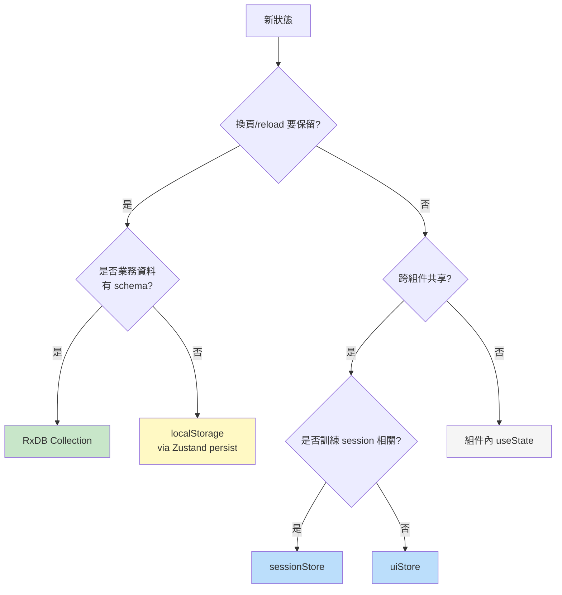

# 06 — 狀態管理 (State Management)

> 本檔定義 React 端「狀態」如何切分、儲存、訂閱、同步。建立在 [02-system-architecture.md](./02-system-architecture.md) §5 的 ADR-006 之上。

---

## 1. 三種狀態的分類

V1 把「狀態」嚴格分成三類、各有所屬：

| 種類           | 範例                                              | 儲存於                | 生命週期       |
| -------------- | ------------------------------------------------- | --------------------- | -------------- |
| **持久資料**   | plans、workouts、exercises、settings              | RxDB (IndexedDB)      | 永久 / 用戶可刪 |
| **session 狀態** | 進行中 workout 的 UI 內部狀態 (currentSetIndex)、restTimer 倒數值 | Zustand `sessionStore` | App session 期間 (記憶體) |
| **UI 狀態**    | theme、modal 開關、表單草稿、bottom-sheet visibility | Zustand `uiStore`     | App session 期間 |

### 1.1 判斷一個狀態屬於哪類的經驗法則

問三個問題，依序決定：

1. **「換頁、reload 後該不該還在？」** → 是 → 持久資料 → RxDB
2. **「跨組件需要共享嗎？」** → 是 → Zustand
3. **「只一個組件內用嗎？」** → 是 → `useState` 即可

> 例外：訓練 session 進行中、即使 reload 也應「能恢復」(因為訓練資料本身在 RxDB)、但「當下倒數還剩幾秒」是 derived from session 的 `restEndsAt`、不需另存 — reload 後重算即可。

---

## 2. Zustand Stores

### 2.1 `uiStore`

```typescript
// packages/web/src/stores/uiStore.ts
import { create } from 'zustand';
import { persist } from 'zustand/middleware';

type UiState = {
  // 主題 (跨 session 持久、用 localStorage)
  theme: 'system' | 'light' | 'dark';
  setTheme: (theme: UiState['theme']) => void;

  // PWA 安裝引導
  installPromptDismissed: boolean;
  dismissInstallPrompt: () => void;

  // Modal / Dialog 控制 (不持久)
  activeModal: 'exit-workout' | 'delete-plan' | 'reset-data' | null;
  openModal: (m: NonNullable<UiState['activeModal']>) => void;
  closeModal: () => void;

  // Toast queue
  toasts: ToastItem[];
  pushToast: (t: Omit<ToastItem, 'id'>) => void;
  dismissToast: (id: string) => void;
};

export const useUiStore = create<UiState>()(
  persist(
    (set) => ({
      theme: 'system',
      setTheme: (theme) => set({ theme }),
      installPromptDismissed: false,
      dismissInstallPrompt: () => set({ installPromptDismissed: true }),
      activeModal: null,
      openModal: (m) => set({ activeModal: m }),
      closeModal: () => set({ activeModal: null }),
      toasts: [],
      pushToast: (t) => set((s) => ({ toasts: [...s.toasts, { ...t, id: nanoid() }] })),
      dismissToast: (id) => set((s) => ({ toasts: s.toasts.filter(t => t.id !== id) })),
    }),
    {
      name: 'fitforge-ui',
      partialize: (s) => ({ theme: s.theme, installPromptDismissed: s.installPromptDismissed }),
    }
  )
);
```

**注意**：`theme` 與 `installPromptDismissed` 用 `persist` middleware 寫 localStorage、其他 (modal / toast) 純記憶體。

### 2.2 `sessionStore`

```typescript
// packages/web/src/stores/sessionStore.ts
type SessionState = {
  // 進行中 workout 的「快取」(真相在 RxDB、這裡是 UI fast path)
  activeWorkoutId: string | null;

  // 訓練中草稿輸入 (用戶開始打但還沒按完成的)
  draftSet: { weight: string; reps: string; rpe: string } | null;
  setDraftSet: (d: SessionState['draftSet']) => void;
  clearDraftSet: () => void;

  // 倒數計時 UI 端
  restEndsAt: string | null; // ISO datetime
  restRemainingSec: number; // tick by RAF / setInterval
  startRest: (seconds: number) => void;
  skipRest: () => void;
  extendRest: (seconds: number) => void;

  // 訓練中折疊狀態
  expandedExerciseIndex: number | null;
  setExpanded: (i: number | null) => void;
};

export const useSessionStore = create<SessionState>((set, get) => ({
  activeWorkoutId: null,
  draftSet: null,
  setDraftSet: (draftSet) => set({ draftSet }),
  clearDraftSet: () => set({ draftSet: null }),
  restEndsAt: null,
  restRemainingSec: 0,
  startRest: (seconds) => {
    const endsAt = new Date(Date.now() + seconds * 1000).toISOString();
    set({ restEndsAt: endsAt, restRemainingSec: seconds });
    // tick logic in useRestTick hook
  },
  skipRest: () => set({ restEndsAt: null, restRemainingSec: 0 }),
  extendRest: (seconds) => {
    const { restEndsAt } = get();
    if (!restEndsAt) return;
    const newEnd = new Date(new Date(restEndsAt).getTime() + seconds * 1000).toISOString();
    set({ restEndsAt: newEnd });
  },
  expandedExerciseIndex: null,
  setExpanded: (i) => set({ expandedExerciseIndex: i }),
}));
```

`sessionStore` **不持久** — reload 後從 RxDB 讀 in-progress workout 重建。

---

## 3. RxDB Reactive Hooks

### 3.1 設計慣例

每個 collection 有對應的 hook：

```typescript
// packages/web/src/features/plans/hooks/usePlans.ts
export function usePlans(filter?: { isPreset?: boolean }) {
  const repo = useCore().planRepo;
  return useRxQuery(() => repo.queryAll(filter), [filter?.isPreset]);
}

export function usePlan(planId: string | null) {
  const repo = useCore().planRepo;
  return useRxQuery(() => planId ? repo.queryOne(planId) : null, [planId]);
}

export function useActivePlan() {
  const repo = useCore().planRepo;
  return useRxQuery(() => repo.queryActive(), []);
}
```

`useRxQuery` 是內建 helper、訂閱 RxDB Observable 並回傳 `{ data, isLoading, error }`。

### 3.2 `useRxQuery` 實作 (核心)

```typescript
// packages/web/src/lib/rxdb/useRxQuery.ts
import { useEffect, useState } from 'react';
import { Observable } from 'rxjs';

export function useRxQuery<T>(
  queryFactory: () => Observable<T> | null,
  deps: React.DependencyList
) {
  const [state, setState] = useState<{ data: T | null; isLoading: boolean; error: Error | null }>({
    data: null,
    isLoading: true,
    error: null,
  });

  useEffect(() => {
    const obs = queryFactory();
    if (!obs) {
      setState({ data: null, isLoading: false, error: null });
      return;
    }
    setState((s) => ({ ...s, isLoading: true }));
    const sub = obs.subscribe({
      next: (data) => setState({ data, isLoading: false, error: null }),
      error: (error) => setState((s) => ({ ...s, isLoading: false, error })),
    });
    return () => sub.unsubscribe();
    // eslint-disable-next-line react-hooks/exhaustive-deps
  }, deps);

  return state;
}
```

### 3.3 為什麼不用 TanStack Query

- TanStack Query 是 server-state cache，invalidation 模型是「query key」
- RxDB 已是 reactive、變更自動推 — 不需要 cache layer
- 加 TQ 等於兩套 source-of-truth、會踩 bug

---

## 4. 業務邏輯 Hooks (Application Layer)

業務邏輯 hook = Application Layer (見 [02-system-architecture.md](./02-system-architecture.md) §2.2)。
這層**編排**：呼叫 Domain Service、更新 store、navigate。

### 4.1 範例：`useStartWorkout`

```typescript
// packages/web/src/features/workout/hooks/useStartWorkout.ts
export function useStartWorkout() {
  const engine = useCore().workoutEngine;
  const navigate = useNavigate();
  const setActive = useSessionStore((s) => s.setActiveWorkoutId);
  const pushToast = useUiStore((s) => s.pushToast);

  return useCallback(async (input: { planId: string; planDayId: string }) => {
    const result = await engine.start(input);
    if (!result.ok) {
      pushToast({ kind: 'error', message: t(`error.${result.error.code}`) });
      return;
    }
    setActive(result.value.id);
    navigate(`/workout/${result.value.id}`);
  }, [engine, navigate, setActive, pushToast]);
}
```

### 4.2 範例：`useLogSet`

```typescript
export function useLogSet(workoutId: string) {
  const engine = useCore().workoutEngine;
  const startRest = useSessionStore((s) => s.startRest);
  const clearDraft = useSessionStore((s) => s.clearDraftSet);
  const pushToast = useUiStore((s) => s.pushToast);

  return useCallback(async (input: { weight: number; reps: number; rpe?: number }) => {
    const result = await engine.logSet({ workoutId, ...input });
    if (!result.ok) {
      pushToast({ kind: 'error', message: t(`error.${result.error.code}`) });
      return;
    }
    clearDraft();
    if (result.value.nextSet) {
      startRest(result.value.restSeconds);
    }
  }, [engine, workoutId, startRest, clearDraft, pushToast]);
}
```

---

## 5. Bootstrap & DI (Dependency Injection)

App 啟動時建立 core、透過 React Context 提供：

```typescript
// packages/web/src/lib/core/CoreProvider.tsx
import { createCore } from '@fitforge/core';
const CoreContext = createContext<ReturnType<typeof createCore> | null>(null);

export function CoreProvider({ children }: { children: React.ReactNode }) {
  const [core, setCore] = useState<ReturnType<typeof createCore> | null>(null);

  useEffect(() => {
    (async () => {
      const c = await createCore({}); // V1 全用預設 adapter
      await c.seedService.ensureSeeded();
      setCore(c);
    })();
  }, []);

  if (!core) return <BootSplash />;
  return <CoreContext.Provider value={core}>{children}</CoreContext.Provider>;
}

export const useCore = () => {
  const c = useContext(CoreContext);
  if (!c) throw new Error('useCore must be inside CoreProvider');
  return c;
};
```

`main.tsx`：

```typescript
<CoreProvider>
  <ThemeProvider>
    <RouterProvider router={router} />
  </ThemeProvider>
</CoreProvider>
```

---

## 6. 狀態同步邊界情況

### 6.1 進行中 workout 的 reload 還原

```typescript
// 在 CoreProvider seeded 完之後
useEffect(() => {
  (async () => {
    const inProgress = await core.workoutRepo.findInProgress('local');
    if (inProgress) {
      const ageHours = (Date.now() - new Date(inProgress.startedAt).getTime()) / 3.6e6;
      if (ageHours > 24) {
        await core.workoutEngine.abandon(inProgress.id);
      } else {
        useSessionStore.getState().setActiveWorkoutId(inProgress.id);
      }
    }
  })();
}, [core]);
```

### 6.2 倒數的還原

`restEndsAt` 是絕對時間。若 reload 時用戶仍在訓練頁面：
- 從 RxDB 取最近一個 `isCompleted: true` set 的 `completedAt`
- 計算 `restEndsAt = completedAt + restSeconds`
- 若 `restEndsAt > now()` → 還原倒數
- 若 `restEndsAt <= now()` → 倒數已結束、不還原

### 6.3 跨分頁 / 跨視窗

如果用戶開兩個分頁：
- RxDB 自動同步 (透過 BroadcastChannel) — 寫一邊另一邊也更新
- Zustand 預設不跨分頁 (各自 in-memory) — V1 不處理 (作品集場景罕見)、若 V2 需要，可加 `zustand/middleware/subscribeWithSelector` + BroadcastChannel adapter

---

## 7. 表單草稿狀態

複雜表單 (Plan Editor) 用 React Hook Form：
- 不寫進 Zustand (作用域只在編輯頁)
- `formState.isDirty` 用於攔截離開 (`useBlocker`) — 防止用戶誤離

簡單表單 (登入 Set 重量) 用 Zustand `sessionStore.draftSet`：
- 訓練中切換到別頁回來、剛打的還在
- 提交後 `clearDraftSet()`

---

## 8. Selector 規範

訂閱 Zustand 時**永遠用 selector**、避免不必要的 rerender：

```typescript
// ❌ 不好
const ui = useUiStore();

// ✅ 好
const theme = useUiStore((s) => s.theme);
const setTheme = useUiStore((s) => s.setTheme);
```

需要多個值時用 `shallow`：

```typescript
import { shallow } from 'zustand/shallow';
const { theme, setTheme } = useUiStore((s) => ({ theme: s.theme, setTheme: s.setTheme }), shallow);
```

---

## 9. 測試策略

| 對象             | 怎麼測                                                  |
| ---------------- | ------------------------------------------------------- |
| Zustand store    | 直接呼叫 `store.getState()` / `store.setState()`、無需 React |
| RxDB hooks       | 用 `@testing-library/react` + in-memory RxDB instance    |
| 業務邏輯 hooks   | mock `useCore`、驗證副作用 (navigate、store 更新)        |
| Domain Service   | 純 Node 環境跑、見 [11-testing-deployment.md](./11-testing-deployment.md) |

---

## 10. 「應該放哪」決策樹



---

## 11. 下一步閱讀

- 想看 Domain Service 的細節 → [05-domain-logic.md](./05-domain-logic.md)
- 想看哪些頁面用哪些 hook → [07-screen-flow.md](./07-screen-flow.md)
- 想看資料夾結構 → [09-monorepo-structure.md](./09-monorepo-structure.md)
