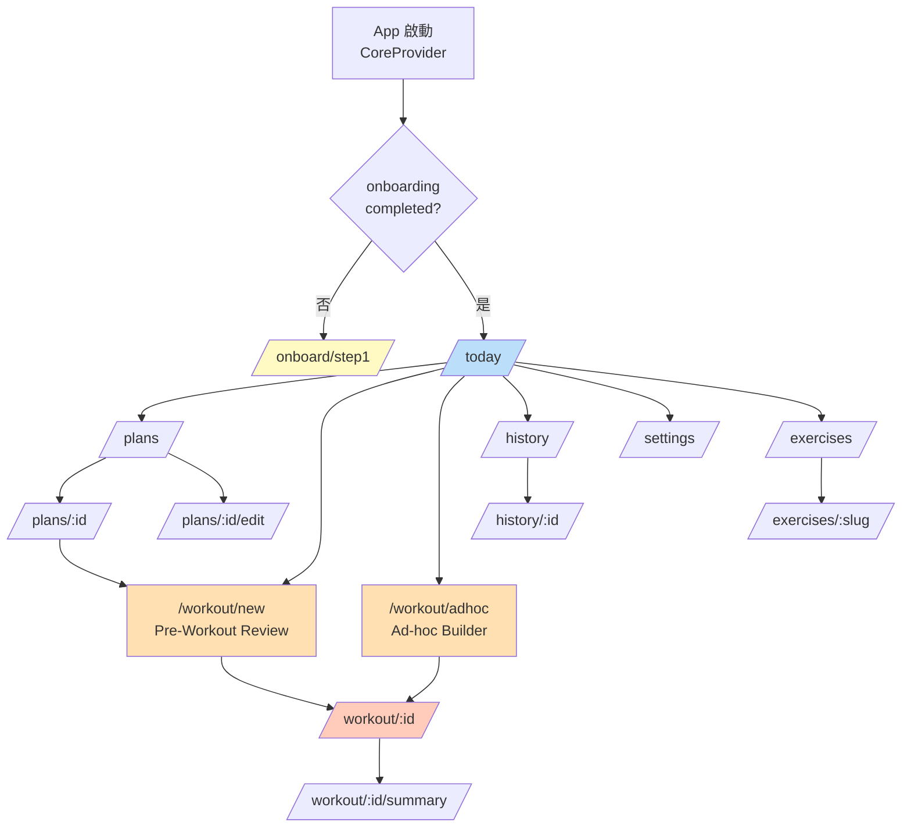

# 07 — 畫面流程與路由 (Screen Flow & Routing)

> 本檔列出 V1 所有畫面、Route map、跳轉關係、onboarding 分流。**對應 [20-claude-design-prompts.md](./20-claude-design-prompts.md) 的每個畫面 prompt**。

---

## 1. 全域導覽結構



「底部導航」永久顯示 4 個 tab：今天 / 課表 / 動作 / 歷史。設定在 Today 頁面右上 icon。

**新增的兩個畫面 (Pre-Workout / Ad-hoc Builder) 是「啟動 Workout」的兩個入口**：
- Pre-Workout Review：從 Plan / Today 點「開始訓練」後、進入訓練前的「微調菜單」頁
- Ad-hoc Builder：從 Today 點「自由訓練」按鈕後、選目標部位 + 動作的頁面

---

## 2. Route 表

| Path                                   | Page Component               | 描述                                          | 守衛           |
| -------------------------------------- | ---------------------------- | --------------------------------------------- | -------------- |
| `/`                                    | redirect → `/today`          | -                                             | -              |
| `/onboard/step1`                       | OnboardingGoalStep           | 選擇訓練目標                                  | -              |
| `/onboard/step2`                       | OnboardingFrequencyStep      | 選擇訓練頻率                                  | step1 完成     |
| `/onboard/step3`                       | OnboardingEquipmentStep      | 選擇可用器材                                  | step2 完成     |
| `/onboard/step4`                       | OnboardingExperienceStep     | 選擇訓練經驗                                  | step3 完成     |
| `/onboard/recommendation`              | OnboardingRecommendation     | 顯示推薦 plan + 確認                          | step4 完成     |
| `/today`                               | TodayPage                    | 首頁、顯示「今天該練什麼」 + 一鍵開始         | onboarded      |
| `/plans`                               | PlansPage                    | 課表列表 (預設 + 自訂)                        | onboarded      |
| `/plans/:planId`                       | PlanDetailPage               | 課表詳情、看每日內容、Fork 按鈕                | onboarded      |
| `/plans/:planId/edit`                  | PlanEditorPage               | 自訂 plan 編輯器 (進階)                       | onboarded + 非 preset |
| `/exercises`                           | ExerciseLibraryPage          | 動作圖庫、搜尋 / 篩選                         | onboarded      |
| `/exercises/:slug`                     | ExerciseDetailPage           | 動作詳情、Lottie 播放、步驟、注意事項          | onboarded      |
| `/workout/new`                         | PreWorkoutReviewPage         | 從 Plan 啟動的「菜單確認」、可微調 (加/減/換)  | onboarded + planId/dayId query param |
| `/workout/adhoc`                       | AdhocBuilderPage             | 自由訓練：選目標部位 + 動作數 + 推薦/自選       | onboarded      |
| `/workout/:workoutId`                  | WorkoutSessionPage           | 訓練中、log set、倒數、加減換                  | onboarded + workout exists |
| `/workout/:workoutId/summary`          | WorkoutSummaryPage           | 訓練結束摘要                                  | workout 完成   |
| `/history`                             | HistoryPage                  | 訓練歷史列表                                  | onboarded      |
| `/history/:workoutId`                  | WorkoutDetailPage            | 歷史單次訓練詳情                              | onboarded      |
| `/settings`                            | SettingsPage                 | 設定                                          | onboarded      |
| `*`                                    | NotFoundPage                 | 404                                           | -              |

### Guard 邏輯

```typescript
// packages/web/src/lib/router/guards.ts
export function requireOnboarded(): LoaderFunction {
  return async () => {
    const { data: settings } = await getSettings();
    if (!settings?.onboardingCompleted) {
      throw redirect('/onboard/step1');
    }
    return null;
  };
}

export function requireWorkoutInProgress(): LoaderFunction {
  return async ({ params }) => {
    const workout = await getWorkout(params.workoutId);
    if (!workout || workout.status !== 'in_progress') {
      throw redirect('/today');
    }
    return null;
  };
}
```

---

## 3. 每個畫面的職責、Hook 依賴、資料邊界

### 3.1 OnboardingGoalStep (`/onboard/step1`)

**目的**：詢問訓練目標。

**內容**：
- 標題：「你想透過健身達到什麼？」
- 4 個大卡片選項：增肌 / 增強力量 / 一般體適能 / 減脂
- 「跳過」連結 (右上)
- 「下一步」按鈕 (底部、選擇後啟用)

**Hooks**：
- `useOnboardingDraft()` — local state 暫存所有 step 答案、最後一步才寫入 RxDB
- `useNavigate()`

**依賴**：無 (沒讀 DB)

**轉場**：
- 點卡片 → 設定 `draft.goal`
- 點下一步 → `navigate('/onboard/step2')`
- 點跳過 → 寫入 `Settings.onboardingCompleted: true` 但留 `onboardingProfile = null` → `navigate('/today')`

---

### 3.2 OnboardingFrequencyStep (`/onboard/step2`)

**內容**：
- 標題：「一週能練幾次？」
- 5 個按鈕：2 / 3 / 4 / 5 / 6
- 副本：「不確定就選 3 — 入門最常見」

**轉場**：選 → 設 draft.frequency → next

---

### 3.3 OnboardingEquipmentStep (`/onboard/step3`)

**內容**：
- 標題：「平常在哪訓練？」
- 4 個選項 (radio-style，但其實是 multi-select)：
  - 在家 (無器材)
  - 在家 (有啞鈴)
  - 健身房 (完整)
  - 健身房 (僅機械)

---

### 3.4 OnboardingExperienceStep (`/onboard/step4`)

**內容**：
- 標題：「健身經驗？」
- 3 個選項：
  - 完全新手 (沒練過)
  - 練過一陣子 (1-6 個月)
  - 有點經驗 (6+ 個月)

---

### 3.5 OnboardingRecommendation (`/onboard/recommendation`)

**目的**：根據前 4 步答案、推薦一個預設 plan。

**內容**：
- 標題：「為你推薦：[Plan Name]」
- 推薦卡片：plan 名稱 + 描述 + 每日 focus 一覽
- 「開始這個課表」主按鈕
- 「自己選課表」次按鈕 → `/plans`

**Hooks**：
- `useOnboardingDraft()` — 取 draft
- `useOnboardingService()` — `recommendPlan(draft)`
- `usePlanService()` — `setActive(planId)`
- `useSettingsRepo()` — `update({ onboardingCompleted: true })`

**轉場**：
- 「開始這個課表」→ 寫入 OnboardingProfile + Settings + 設 active plan → `navigate('/today')`
- 「自己選課表」→ 寫入 OnboardingProfile + Settings → `navigate('/plans')`

---

### 3.6 TodayPage (`/today`)

**目的**：首頁、「今天該做什麼」一目了然。

**內容區塊**：
1. **頂部問候**：「早安 ☀️」/ 「下午好」/ 「晚安」依時段
2. **今日訓練卡** (主視覺、大)
   - 若有 active plan：顯示「今天是 Day X：[name]」+ 預覽動作清單 (前 3 個) + 「開始訓練」大按鈕 (→ `/workout/new?planId=...&dayId=...`)
   - 若無 active plan：顯示「選一個課表開始」+ 連結到 `/plans`
   - 若有 in-progress workout：顯示「繼續訓練」按鈕 + 上次中斷時間
3. **自由訓練入口** (次要按鈕、Today 卡之下、橫向)
   - 文案：「沒在跑課表？自由訓練」
   - icon: shuffle
   - 點擊 → `/workout/adhoc`
4. **本週節奏** (mini calendar、橫向 7 天)：標記已訓練的日子
5. **最近訓練** (latest 3 個 workout 卡片) — 含 ad-hoc 訓練、用不同 chip 標記
6. **動作精選** (隨機 3 個 exercise card 引導探索)

**Hooks**：
- `useActivePlan()` — RxDB reactive
- `useInProgressWorkout()`
- `useRecentWorkouts(3)`
- `useRandomExercises(3)`
- `useStartWorkoutFromActivePlan()` — 一鍵開始

**主要互動**：
- 「開始訓練」→ `useStartWorkout` 觸發 → `navigate('/workout/:id')`

---

### 3.7 PlansPage (`/plans`)

**目的**：所有課表列表。

**內容**：
- 分段：
  - **我的自訂課表** (若有)
  - **預設課表** (3 個)
- 每個課表 card：name、frequency、focus tags、active 標記、Fork 按鈕
- 右上 FAB：「+ 新增空白課表」→ `/plans/new/edit`

**Hooks**：
- `usePresetPlans()`
- `useUserPlans()`
- `useSetActivePlan()`
- `useForkPreset()`

---

### 3.8 PlanDetailPage (`/plans/:planId`)

**目的**：看一個 plan 的完整結構。

**內容**：
- Plan name + description
- 每日 (Day 1, Day 2…) 折疊區塊
  - 每個 exercise：縮圖 + name + sets × reps + rest
- Footer 按鈕：
  - 若是 preset：「設為使用中」+ 「複製到我的」
  - 若是自訂：「設為使用中」+ 「編輯」+ 「刪除」

**Hooks**：
- `usePlan(planId)`
- `usePlanService()` (for activate / fork / delete)

---

### 3.9 PlanEditorPage (`/plans/:planId/edit`)

**目的**：自訂 plan 的編輯器 (V1 最複雜的表單)。

**內容**：
- 頂部：plan name、description 編輯
- Tabs / sections：每個 Day (可新增 / 刪除 / 重排)
- 每個 Day 下：exercise list (可新增、拖拉重排、刪除)
- 點 exercise → 開啟 sheet：選 exercise (從動作庫)、設 sets、reps min/max、rest seconds、notes
- 底部：「儲存」(主)、「取消」(次)、「刪除課表」(右側)

**Hooks**：
- `usePlan(planId)` — initial form value
- `useForm()` (RHF + Zod resolver)
- `useExercises()` — 動作選擇器資料
- `usePlanService()` — update / delete

**離開保護**：
- 表單 dirty 且未儲存 → 使用 `useBlocker` 攔截、彈 modal 「未儲存的變更會丟失」

---

### 3.10 ExerciseLibraryPage (`/exercises`)

**目的**：所有動作的可搜尋圖庫。

**內容**：
- 搜尋框 (即時 filter、中英文皆可)
- 篩選 chip：肌群 / 器材 / 難度 (可多選)
- Grid 顯示 ExerciseCard：縮圖 (Lottie 第一幀作為靜態 preview) + 中文名 + tags

**Hooks**：
- `useExercises({ search, muscleGroups, equipment, difficulty })`

**設計考量**：
- 列表用 virtualization (`react-virtual`) 以防未來動作數量大
- Lottie 縮圖 lazy — 滾到才載入 / 播放
- 點卡片 → `/exercises/:slug`

---

### 3.11 ExerciseDetailPage (`/exercises/:slug`)

**目的**：學一個動作。

**內容**：
- 頂部 Hero：大 Lottie 動畫 (autoplay loop)、底部播放控制 (慢放 / 暫停)
- 名稱 (中文 + 英文小字)
- Tags row：肌群、器材、難度
- 「步驟」section：1, 2, 3, 4 …
- 「重點提醒」section (icon: 💡)
- 「常見錯誤」section (icon: ⚠️)
- (V2 預留：「在我的訓練紀錄中找這個動作」連結)

**Hooks**：
- `useExerciseBySlug(slug)`

---

### 3.11a PreWorkoutReviewPage (`/workout/new`) — 新增

**目的**：從 Plan / Today 啟動訓練前的「菜單預覽 + 微調」頁。是「Plan = 模板、Workout = 實作」的轉接點。

**Query 參數**：`?planId=...&dayId=...`

**內容區塊**：
1. **頂部 header**：
   - ← 返回 (回 Today / Plans)
   - 標題：「準備開始：[Plan Day name]」
   - 副標 (caption muted)：plan name
2. **預估摘要 chip 列**：
   - 預估時長 (依組數 + rest 估算)
   - 動作數
   - 主要部位 chips (從動作的 bodyPart 推算)
3. **動作列表** (核心)：
   - 每個 item：縮圖、name、bodyPart chip + muscles chip、targetSets×reps、rest
   - 右側 action icons (依 `isSwappable` 顯示)：
     - 🔄 換 (若 isSwappable: true) — 開啟 Swap Sheet
     - ❌ 移除 — confirm 後刪 item
     - ↕️ 拖拉排序
   - 不可換的動作 (例：Deadlift)：顯示 🔒 icon、不可動
4. **「+ 新增動作」row** (列表底部、虛線 border):
   - 點開啟 sheet：「從動作庫選」或「依目前部位推薦」(call ExerciseQueryService.pickForBodyParts)
5. **底部 sticky bar**：
   - 「取消」outline (回 Today / Plans)
   - 「開始訓練 →」primary、大、滿寬

**Hooks**：
- `usePreWorkoutBuilder({ planId, dayId })` — 建立 draft、暴露 add/remove/swap/reorder API
- `useStartFromDraft()` — 確認後呼叫 `WorkoutEngine.start()`

**對新手友善**：
- 預設摺疊「進階」狀態 (不顯示 swap/remove icons)、頂部有「微調」toggle 開啟
- 新手大多直接點「開始訓練」就走、不需要動

---

### 3.11b AdhocBuilderPage (`/workout/adhoc`) — 新增

**目的**：自由訓練啟動頁。沒跟 Plan、用戶自己訂主題與動作。

**內容區塊** (兩個 step、用 stepper):

**Step 1：選目標部位**
- 標題：「今天想練什麼？」
- 副標：「可複選、之後可調」
- 7 個 bodyPart chip (multi-select)：胸 / 背 / 肩 / 手臂 / 腿 / 核心 / 全身
- selected chip 樣式：bg-primary + scale 1.05
- 底部 「下一步」disabled until 至少選 1 個

**Step 2：選動作數 + 方式**
- 標題：「想做幾個動作？」
- Stepper：3 / 4 / 5 / 6 / 7 / 8 (預設 5)
- 兩個 CTA 卡片：
  - **智慧推薦** (primary、大)
    - icon: ✨
    - 文案：「依你選的部位、自動推薦 [N] 個動作」
    - 點擊 → 呼叫 `ExerciseQueryService.pickForBodyParts` → 進 PreWorkoutReview (帶 draft)
  - **自己挑** (outline、次)
    - icon: 📚
    - 文案：「進動作庫多選 [N] 個」
    - 點擊 → 進 ExerciseLibraryPage 的 multi-select 模式 → 確認後進 PreWorkoutReview

**Hooks**：
- `useAdhocDraft()` — local state 暫存 bodyParts + count
- `useExerciseQueryService()` — pickForBodyParts
- `useExerciseLibraryMultiSelect()` — 進入 ExerciseLibrary 多選並 callback 回來

**轉場**：
- Step 2 確認後不直接進 Workout、而是進 `/workout/new` (PreWorkoutReview) 帶 ad-hoc draft、給用戶最後一次調整機會。

---

### 3.12 WorkoutSessionPage (`/workout/:workoutId`) — 最關鍵 ⭐

**目的**：訓練中的主畫面。一切 UX 圍繞「不分心、不誤觸、看得清」。

**內容區塊**：
1. **頂部**：訓練時長計時 + 訓練名稱 + 「結束」按鈕 (右上)
2. **當前動作 Hero**：
   - 動作名稱 + 動作 Lottie (小縮圖、點開放大)
   - 「第 X / Y 組」
   - 目標：80kg × 8-10 下 (從 plan 取)
   - **大型輸入區**：重量 (kg/lb)、次數、RPE (可選)
   - **「完成這組」主按鈕** (滿寬、巨大)
3. **倒數覆蓋層** (resting 時)：
   - 半透明蓋住輸入區
   - 大字倒數 (00:90 → 00:00)
   - 「跳過」+ 「+15 秒」按鈕
   - 上次紀錄回顧 (右下小字)：「上次：80kg × 9 ✓」
4. **下方動作列表** (摺疊區)：
   - 所有動作 + 完成度 dot
   - 點任一動作可切換到該動作 (自由訓練順序)
   - 每個 item 右側 swipe 或 long-press → 出現操作：
     - 🔄 換動作 (若 `isSwappable`) → 開啟 Swap Sheet (見 §3.20)
     - ❌ 移除 (僅當未完成任何 set)
   - 列表末「+ 加動作」row → 開啟 Add Sheet (見 §3.20)
   - 動作來源 chip (small caption)：「計畫」/「訓練中加」/「換的」、給用戶意識

**Hooks**：
- `useWorkoutSession(workoutId)` (RxDB reactive 訂閱該 workout 文件)
- `useLogSet(workoutId)`
- `useSkipSet(workoutId)`
- `useFinishWorkout(workoutId)`
- `useSessionStore` (取 restEndsAt、draftSet)
- `useRestTick()` — 倒數 RAF tick

**特殊互動**：
- 鎖屏時 (Wake Lock API) 防止螢幕關閉 — V1 用 `navigator.wakeLock.request('screen')`
- 點「結束」彈 confirm modal「結束本次訓練？已紀錄的組會保留」
- 安卓返回鍵 / iOS swipe back → 不關閉、改彈「離開訓練？」(因為訓練是 stateful、不能輕易離開)

---

### 3.13 WorkoutSummaryPage (`/workout/:workoutId/summary`)

**目的**：訓練結束的成就感頁。

**內容**：
- 🎉 標題：「訓練完成！」
- 大字統計：
  - 總時長 45:32
  - 總噸位 4,250 kg
  - 完成組數 18 / 18
- PR 慶祝 (若有)：「💪 新 PR — Back Squat 100kg × 5」
- 動作列表 (摘要)：每個動作的 sets 表
- 「分享圖」按鈕 (V1：產一張 PNG canvas)
- 「回首頁」按鈕

**Hooks**：
- `useWorkout(workoutId)`
- `useWorkoutSummary(workoutId)` (StatsService 結算)

---

### 3.14 HistoryPage (`/history`)

**目的**：所有完成的訓練紀錄。

**內容**：
- 月份 group header (Sticky)
- 每個 workout row：日期 / 名稱 / 時長 / 總噸位 / 動作數
- 滑動可刪除 (軟刪)
- 上方 mini stats bar：「本月訓練 X 次」

**Hooks**：
- `useWorkoutHistory({ limit: 50 })` — paginated
- `useMonthlyStats()`

---

### 3.15 WorkoutDetailPage (`/history/:workoutId`)

**目的**：歷史單次訓練詳情 (read-only)。

**內容**：
- 基本資訊
- 每個 exercise + 所有 sets 表 (weight × reps × RPE)
- 與「上次該動作」的對比 (% 進步)

---

### 3.16 SettingsPage (`/settings`)

**內容區塊**：
- 一般
  - 主題 (system / light / dark)
  - 單位 (kg / lb)
  - 訓練音效開關
  - 震動開關
  - 預設組間休息秒數
- 資料
  - 匯出資料 (.json 下載)
  - 匯入資料 (檔案選擇)
  - 清空所有資料 (危險、需二次確認)
- 關於
  - 版本號
  - 開源連結 (GitHub)
  - 給自己的 credit

**Hooks**：
- `useSettings()`
- `useExportService()`

---

### 3.17 NotFoundPage (`*`)

簡單 404 + 「回首頁」按鈕。

---

### 3.20 Swap / Add Exercise Sheet (新增) — Bottom Sheet 非獨立路由

**出現位置**：PreWorkoutReviewPage、WorkoutSessionPage、PlanEditorPage 共用。

#### 3.20.a Swap Sheet

**觸發**：點某動作的 🔄 icon。

**內容**：
- 頂部 drag handle + 標題：「替換 [動作 name]」
- 副標：「相同主肌群的其他選擇」+ 動作的 muscles chip
- 列表：`ExerciseQueryService.findSubstitutes` 結果 (預設 Tier 1)
  - 每 item：縮圖、name、muscles chip、equipment chip
  - 「自己挑」連結 (進 ExerciseLibrary、ones-shot 選一個)
- 點 item → 確認 confirm → 套用 swap、close sheet
- 空狀態：「沒有相同主肌群的動作」+ 「放寬到同部位」按鈕 (放寬到 Tier 2)

**Hooks**：
- `useFindSubstitutes(exerciseId, swapScope)`
- `useSwapExercise()` (PreWorkout: 改 draft；Session: 呼叫 WorkoutEngine.swapExercise)

#### 3.20.b Add Sheet

**觸發**：點 PreWorkout 列表底「+ 新增動作」或 Session 中「+ 加動作」。

**內容**：
- 頂部 drag handle + 標題：「新增動作」
- Tabs：
  - **依部位**：bodyPart chip 7 個、選後顯示對應動作
  - **依肌群**：muscles chip 21 個 (collapsible group by bodyPart)
  - **搜尋**：input + 結果即時 filter
- 列表同 ExerciseLibrary card 樣式
- 點 item → 設定 sheet：targetSets / repsMin / repsMax / rest stepper (預設依 difficulty、見 [05-domain-logic.md §9.5](./05-domain-logic.md))
- 確認 → close sheet、套用

**Hooks**：
- `useExerciseQuery()` (依 filter / search)
- `useAddExercise()` (PreWorkout: 改 draft；Session: 呼叫 WorkoutEngine.addExercise)

---

## 4. Layout 與導覽結構

```
<AppShell>
  <Header />     {/* 視 route 顯示 */}
  <main>
    <Outlet />   {/* React Router 路由 */}
  </main>
  <BottomNav /> {/* 4 tab: 今天/課表/動作/歷史 */}
  <ToastViewport />
</AppShell>
```

**例外**：
- Onboarding 不顯示 BottomNav
- WorkoutSession 不顯示 BottomNav (防誤觸)、Header 簡化
- ExerciseDetail / WorkoutDetail / WorkoutSummary 用 modal-style (透明背景)

---

## 5. 鍵盤 / a11y 焦點順序

每個畫面預設 focus 位置：

| 畫面                | 預設 focus               |
| ------------------- | ------------------------ |
| Today               | 「開始訓練」按鈕         |
| WorkoutSession      | 重量輸入框               |
| Onboarding          | 第一個選項               |
| ExerciseLibrary     | 搜尋框                   |
| PlanEditor          | 課表名稱輸入框           |

---

## 6. 轉場動畫 (Motion)

V1 簡單原則：
- 同 navigation stack 內：iOS-style horizontal slide (用 framer-motion)
- Modal / Sheet：bottom-up
- 訓練組完成 → 倒數出現：淡入 + slight scale
- 不過度、不擾人

---

## 7. 錯誤 / 空狀態畫面

每個列表頁面有對應的「空狀態」設計：

| 頁面            | 空狀態 message + CTA                              |
| --------------- | ------------------------------------------------- |
| Today (無 plan) | 「還沒選課表？」 + 「去選一個」                   |
| Plans (無自訂)  | (顯示預設 plan + 「+ 新增空白課表」CTA)            |
| History         | 「還沒有訓練紀錄」 + 「開始第一次訓練」            |
| Exercises (篩選無結果) | 「找不到動作」 + 「清除篩選」              |

錯誤狀態：toast + 偶爾 inline (load 失敗時)。

---

## 8. 下一步閱讀

- 想看每個畫面的設計 prompt → [20-claude-design-prompts.md](./20-claude-design-prompts.md)
- 想看背後的 hook + service → [05-domain-logic.md](./05-domain-logic.md) / [06-state-management.md](./06-state-management.md)
- 想看 PWA 安裝與離線體驗 → [08-pwa-offline.md](./08-pwa-offline.md)
