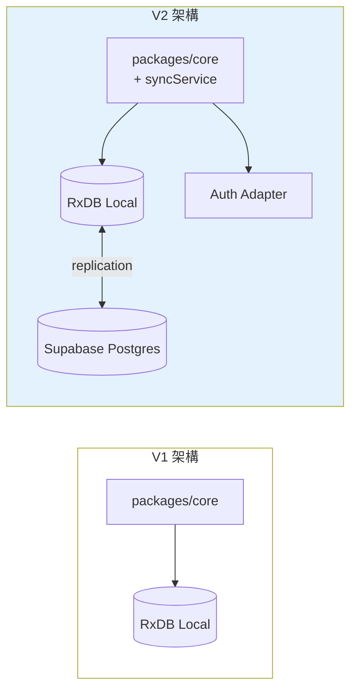

# 12 — V2 路線圖 (V2 Roadmap)

> V2 不是「V1 + 一堆功能」、而是「V1 已預留的點全部接通」。本檔列出 V2 範疇、優先序、預估規模、對 V1 架構的擾動程度。

---

## 1. V2 願景

> 把 V1 「**自用級別**」的本地工具、升級為「**社群可用**」的健身平台 — 多裝置同步、AI 教練、量化進度、可選社群。

設計目標仍是「健身新手」核心、但給予「持續訓練了 2-3 個月」用戶留下來的理由。

---

## 2. V2 範疇 (Scope)

依優先序：

### Tier 1 (必做 — 不做 V1 沒升級價值)

1. **雲端同步 (Cloud Sync)** — 跨裝置、不換手機就資料消失
2. **帳號系統** — Email + Apple/Google OAuth
3. **AI 教練 (Phase 1)** — Plan 推薦 + 訓練後總結

### Tier 2 (應做 — 用戶會問)

4. **量化進度** — 體重曲線、體態照、PR 趨勢
5. **動作影片** — Lottie 之外、可選短影片補充
6. **React Native 行動版** — 真正的 native 體驗
7. **Push Notifications** — 訓練提醒、堅持鼓勵
8. **AI 教練 (Phase 2)** — 訓練中即時建議、動作替換

### Tier 3 (可做 — 看時間 / 用戶數)

9. **穿戴整合** — Apple Health / Health Connect 讀寫
10. **飲食追蹤** — 卡路里、TDEE、巨量營養
11. **社群** — 好友、貼文、月度挑戰
12. **教練 + 學員雙端** — B2B2C

### Tier 4 (可能永不做)

13. App Store / Play Store 上架
14. Apple Watch 伴侶 app
15. 智慧型 1RM 估算
16. 動作姿勢辨識 (Vision + ML)

---

## 3. V2 Tier 1 詳細規劃

### 3.1 雲端同步 — `Cloud Sync`

#### 技術選型

| 選項               | 評估                                                          |
| ------------------ | ------------------------------------------------------------- |
| **Supabase + RxDB Postgres replication** | ✅ 推薦。RxDB Premium 有 Postgres adapter (或自寫 GraphQL adapter) |
| **CouchDB / PouchDB sync** | RxDB native 支援、但要自架或用 IBM Cloudant      |
| **Firebase + 自寫 sync** | RxDB 與 Firestore 不合、不採用                       |
| **PowerSync**       | 強大、商業、收費                                              |

#### 同步策略

- **Eventual consistency** — 本地永遠是真相、後台同步
- **Conflict resolution**：last-write-wins (V2 早期)；可升 CRDT (V3)
- **同步單元**：document-level (RxDB 預設)、足夠細

#### 架構變動 (對 V1)



#### 新增 collection / 欄位

- `users` (Supabase Auth 自動產) — V1 用 `userId: 'local'`、V2 換成 Supabase user id
- 所有 schema 已有 `userId`、不需 migration
- `syncMeta` collection (新增)：每個本地 document 的同步狀態 (synced / pending / conflict)

#### V1 → V2 遷移路徑

1. V1 用戶開 V2 首次：彈出「想要備份資料到雲端嗎？」
2. 同意 → 註冊帳號 → 把 local 資料 (含所有 `userId: 'local'`) 改寫為 `userId: real_user_id`
3. 啟動 replication → 推到雲端
4. 拒絕 → 繼續本地、可隨時打開設定啟用

#### 規模估算

- Domain 改動：小 (Repository 加 sync hook)
- Data 改動：中 (新 syncMeta collection、所有 schema bump version)
- UI 改動：中 (新 Auth flow、新 Settings 區塊)
- 風險：中 (sync 邊界情況多)

---

### 3.2 帳號系統 — `Auth`

#### 技術選型
- Supabase Auth：Email + Apple OAuth + Google OAuth + Magic Link

#### 設計重點
- **匿名帳號**：V2 默認仍允許不註冊 (local)、訓練 N 次後才提示
- **轉換流程**：local → registered 必須無痛 (local 資料合併進新帳號)
- **登出**：保留 local 資料、清空 sync meta、再可重新註冊或匿名

#### UI 新增畫面
- `/auth/login`
- `/auth/register`
- `/auth/forgot-password`
- `/settings/account`

---

### 3.3 AI 教練 Phase 1 — `AI Coach P1`

實作 [10-ai-extension-points.md](./10-ai-extension-points.md) 的：
- `recommendPlan` — onboarding 結束時 + Settings 「重新推薦」按鈕
- `postWorkoutReview` — workout summary 頁

#### 架構變動
- `ClaudeAIAdapter` 實作 (見 10 §4)
- API key 透過 Supabase Edge Function 代理 (不放 client)
- 加入 prompt cache、降低成本

#### UI 變動
- `OnboardingRecommendation` 加「為你客製」按鈕
- `WorkoutSummary` 加 AI summary 區塊
- `Settings/AI` 新分區 (可關閉、可換 model)

#### 規模估算
- Adapter 實作：小 (200 行)
- Server-side proxy：中 (Edge Function、rate limit)
- UI 整合：小
- Prompt tuning：**中 → 大** (需多次迭代測試)

---

## 4. V2 Tier 2 細節 (摘要)

### 4.1 量化進度

#### 新 collection (V1 預備、V2 啟用)

```typescript
export const MeasurementSchema = z.object({
  id: z.string().regex(/^mm_/),
  userId: z.string(),
  type: z.enum(['bodyweight', 'bodyfat', 'waist', 'chest', 'arm', 'thigh', 'photo']),
  value: z.number().nullable(),  // photo 時為 null
  unit: z.enum(['kg', 'lb', 'cm', 'in', null]),
  photoBlob: z.string().nullable(), // base64 or URL
  measuredAt: z.string().datetime(),
  notes: z.string().max(200).default(''),
  createdAt: z.string().datetime(),
  updatedAt: z.string().datetime(),
  deletedAt: z.string().datetime().nullable(),
});
```

#### 新 page
- `/progress` — 主進度頁 (圖表、體重曲線、PR 列表)
- `/progress/add` — 新增量測
- `/progress/photos` — 體態照前後對比

#### 圖表
- 用 [Recharts](https://recharts.org/) 或 [visx](https://airbnb.io/visx/) — Tree-shake 友善
- 體重曲線、訓練量曲線、PR 趨勢

### 4.2 React Native 行動版

#### 結構
```
packages/native/    # 新增 Expo + React Native app
```

#### 技術選型
- **Expo SDK 50+** — managed workflow、EAS Build
- **Expo Router** — file-based routing
- **NativeWind** (Tailwind for RN) — 樣式重用
- **React Native Reanimated 3** — 動畫
- **lottie-react-native** — Lottie 跨端

#### 共用度
- `packages/core` — 100% 共用 (這是 V1 monorepo 預留的最大價值)
- UI components — 0% 共用 (Web vs Native 各寫)
- Hooks — 80% 共用 (大部分純邏輯 hook 可搬、UI hook 不可)

#### 規模估算
- 設置 RN：中
- 重寫所有畫面：**大** (15-20 個畫面)
- 整合 HealthKit / Health Connect：中
- App Store 上架：中 (含審核)

### 4.3 動作影片

`Exercise` schema 已預留 `videoUrl?: string`。V2 啟用：
- Lottie 為主、影片為輔 (用戶可選「看示範影片」)
- 影片放 Supabase Storage 或 Cloudflare R2 (便宜)
- 對動作要求精細的用戶有用、新手 Lottie 已足

### 4.4 Push Notifications

#### 用途
- 預設訓練日提醒 (用戶設「週一三五」即發)
- 連續訓練鼓勵 (3/5/7 天 streak)
- 已開始訓練 24+ 小時、提醒「結束或放棄」

#### 技術
- Web Push (V2 PWA) — 透過 Service Worker、用 web-push library
- iOS PWA push (16.4+) — 需 standalone 模式
- RN Push — Expo Notifications

#### 後端
- Supabase Edge Function 定時掃 → 推
- 用戶可在 Settings 細調哪些要、哪些不要

### 4.5 AI 教練 Phase 2

實作 [10-ai-extension-points.md](./10-ai-extension-points.md) 的：
- `liveAdvice` — 訓練中 toast (節流：每 5 組 / 達 PR / RPE 危險時)
- `suggestSubstitutes` — Exercise Detail 頁加按鈕

延伸：
- **AI 摘要對話** (V2 後段)：用戶在 Settings 「跟教練聊」、context 是訓練史
- **語音輸入** (V2 後段)：訓練中可語音 log set ("Bench, 60 by 10")

---

## 5. V2 Tier 3 細節 (簡)

### 5.1 穿戴整合
- HealthKit (iOS) — 寫入「訓練」資料、讀心率 (要 RN)
- Health Connect (Android) — 同上
- Web 端：用 Web Bluetooth 對接心率帶 (簡單版)

### 5.2 飲食追蹤
獨立 module：
- 食物資料庫 (TKFOOD / 自建)
- 拍照辨識 (Claude Vision API)
- 巨量營養目標 vs 實際
- TDEE 計算器

### 5.3 社群
- 好友 (互加好友、看訓練紀錄)
- 月度挑戰 (例：1 個月 12 次訓練)
- 訓練心得貼文 (帶 moderation)

考量：增加 moderation 成本、可能不做。

### 5.4 教練 + 學員雙端
- 教練端：開 plan 給學員、看執行情況、留 feedback
- 學員端：收 plan、執行、回報
- 商業模式：教練付月費

---

## 6. 安全 / 隱私 (V2 因有後端、需重視)

| 主題                   | V2 計畫                                                            |
| ---------------------- | ------------------------------------------------------------------ |
| 帳號安全               | Supabase Auth (PBKDF2、JWT、refresh token rotation)                |
| Row Level Security     | Supabase RLS — 每個 row 加 `user_id = auth.uid()` 過濾             |
| API 速率限制           | Cloudflare 或 Supabase Edge Rate Limiting                          |
| AI API key             | Server-side only (Edge Function)、永不暴露                          |
| GDPR / 資料下載 / 刪除  | 加「下載我的資料」「刪除帳號」按鈕                                  |
| Encryption at rest     | Supabase 預設                                                       |
| Encryption in transit  | HTTPS 強制                                                          |
| 個資範圍               | 不蒐集姓名、僅 email；體態照存用戶私有 bucket                      |

---

## 7. 觀察 / 監控 (V2 加上)

- **PostHog** (self-host 或 cloud) — Product analytics、尊重隱私
- **Sentry** — 錯誤追蹤 (web + native)
- **Plausible** — 流量 (避免 GA)
- 用戶可關閉所有 telemetry

---

## 8. V1 → V2 過度的關鍵不變式

> V1 設計時必須守住、否則 V2 痛苦。

1. ✅ `packages/core` 純 TS、零 React 相依
2. ✅ 所有 schema 有 `userId` 欄位、預設 `'local'`
3. ✅ 所有 schema 有 `createdAt`、`updatedAt`、`deletedAt`
4. ✅ 所有 ID 經 `IdPort` 產生 (V2 可換 UUID v7 利於同步排序)
5. ✅ `AIPort` 介面已定義、V1 用 noop
6. ✅ Repository 介面與實作分離、可換 adapter
7. ✅ i18n key 已抽
8. ✅ Soft delete 而非 hard delete

只要這 8 條守住、V2 90% 工作量是「新增」而非「重構」。

---

## 9. 時程預估 (給未來自己參考、非承諾)

| Tier            | 模組                  | 預估個人專案投入 (假設 part-time) |
| --------------- | --------------------- | --------------------------------- |
| **V1 MVP**      | 整套                  | 8-12 週                           |
| V2 Tier 1       | Cloud Sync + Auth     | 4-6 週                            |
|                 | AI Coach Phase 1      | 2-3 週                            |
| V2 Tier 2       | 量化進度              | 2-3 週                            |
|                 | React Native          | 6-10 週                           |
|                 | Push Notifications    | 1-2 週                            |
|                 | AI Coach Phase 2      | 3-4 週                            |
| V2 Tier 3       | 各模組                | 視野心、可選                       |

---

## 10. 不會做的事 (Explicit Non-Goals — V2)

- ❌ 變成「全能健身平台」(社交、線上課程、商城等)
- ❌ 收費訂閱 (V2 也不收、保留個人專案性質；除非未來決定商業化)
- ❌ 即時心率分析、AI 教練即時動作糾正
- ❌ 線上比賽、leaderboard、gamification 過頭
- ❌ 多語系超過 3 種 (zh-TW、zh-CN、en 為上限)

---

## 11. 下一步閱讀

- 想看 AI 介面預留 → [10-ai-extension-points.md](./10-ai-extension-points.md)
- 想看 V1 為何 monorepo → [02-system-architecture.md](./02-system-architecture.md) §2
- 想開始 V1 → [SDD.md](./SDD.md) §9 實作前 Checklist
