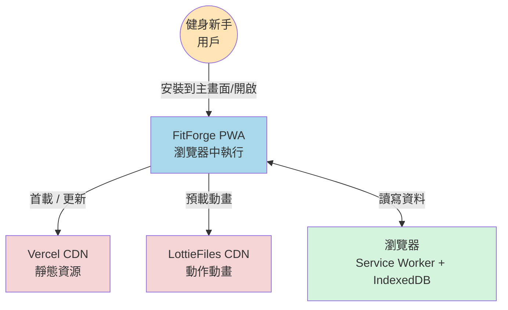
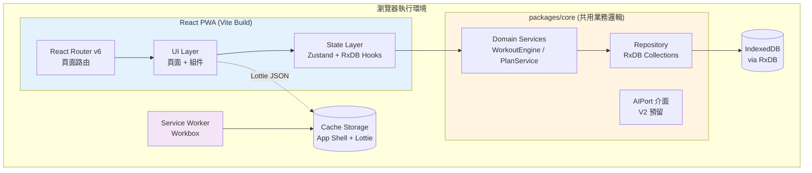
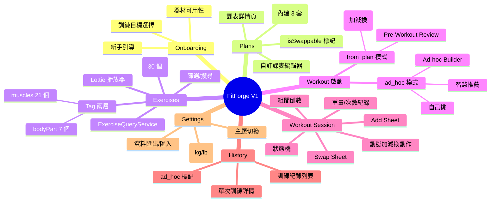
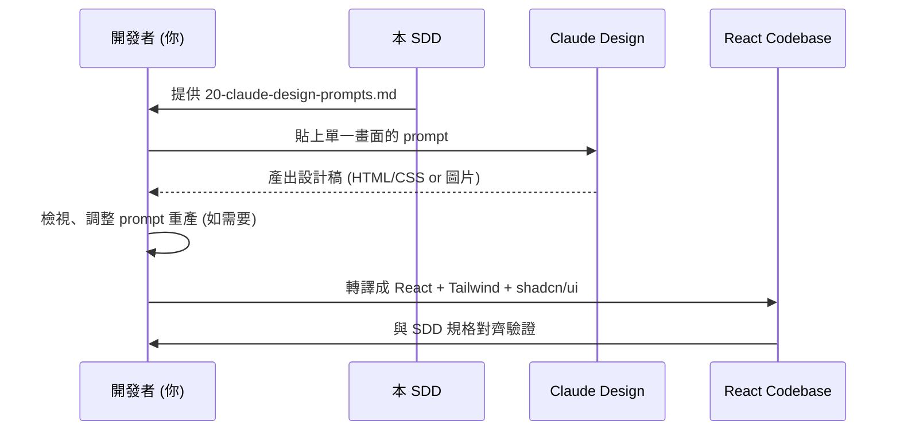

# Fitness App — Software Design Document (SDD)

> **專案代號**：FitForge (暫定，可在敲定品牌時替換)
> **版本**：V1.0 MVP — Local-first PWA for Fitness Beginners
> **建立日期**：2026-05-14
> **文件狀態**：Draft (pre-implementation)
> **目標讀者**：實作者本人 / 未來協作者 / 作品集審閱者

---

## 0. 文件地圖 (Document Map)

本 SDD 採「主檔索引 + 子檔深入」結構。**先讀本檔取得全貌，需要細節時跳到對應子檔**。

| #  | 子文件                                                                       | 描述                                                          | 預估閱讀時間 |
| -- | ---------------------------------------------------------------------------- | ------------------------------------------------------------- | ------------ |
| 01 | [01-product-overview.md](./01-product-overview.md)                           | 產品定位、Persona、MVP 範疇、成功指標、非目標                  | 8 min        |
| 02 | [02-system-architecture.md](./02-system-architecture.md)                     | 分層架構、C4 三層圖、模組互動、依賴方向                        | 15 min       |
| 03 | [03-tech-stack.md](./03-tech-stack.md)                                       | 每項技術選擇與權衡、版本鎖定、替代方案                          | 12 min       |
| 04 | [04-data-model.md](./04-data-model.md)                                       | RxDB schemas、ER 圖、索引、migration                          | 15 min       |
| 05 | [05-domain-logic.md](./05-domain-logic.md)                                   | 業務邏輯、領域服務、用例描述、Workout Session 狀態機           | 15 min       |
| 06 | [06-state-management.md](./06-state-management.md)                           | Zustand store 切分、RxDB reactive query 整合、cache 策略       | 10 min       |
| 07 | [07-screen-flow.md](./07-screen-flow.md)                                     | 全部畫面、Route map、導覽圖、onboarding 分流                   | 12 min       |
| 08 | [08-pwa-offline.md](./08-pwa-offline.md)                                     | Service Worker、Workbox 策略、manifest、Lottie 預載、安裝體驗 | 10 min       |
| 09 | [09-monorepo-structure.md](./09-monorepo-structure.md)                       | pnpm workspace、packages/core、packages/web、未來 native       | 10 min       |
| 10 | [10-ai-extension-points.md](./10-ai-extension-points.md)                     | V2 AI 教練 service interface、prompt 策略、資料採集點         | 8 min        |
| 11 | [11-testing-deployment.md](./11-testing-deployment.md)                       | 測試金字塔、E2E、Vercel 部署、CI/CD                            | 10 min       |
| 12 | [12-roadmap-v2.md](./12-roadmap-v2.md)                                       | V2 路線：React Native、Cloud sync、AI、量化進度、社群、飲食    | 10 min       |
| 13 | [13-exercise-tagging.md](./13-exercise-tagging.md)                           | **動作 Tag 系統**：bodyPart + muscles 完整列表、篩選 + swap 演算法 | 10 min       |
| 20 | [20-claude-design-prompts.md](./20-claude-design-prompts.md)                 | **給 Claude Design 的提示詞**(每個畫面一段、可直接貼、§1-§30) | 自由探索     |

**架構圖原始檔**位於 [diagrams/](./diagrams/) 子目錄 (Mermaid `.mmd`)，在子文件中以行內方式渲染。

---

## 1. 執行摘要 (Executive Summary)

### 一句話定位
> 一個**離線可用、零註冊、教學完整**的健身入門 PWA — 讓「第一次走進健身房的人」能在手機上拿到 3 套預設課表、看著 Lottie 動畫做動作、把每組重量記下來。

### 核心問題
1. 健身新手最大的恐懼是「不知道做什麼、怎麼做、做多少」。
2. 既有 app 多數要求註冊、要訂閱、訓練中 UI 不友善（鎖屏後狀態消失、操作步驟多）。
3. 新手沒有訓練資料時，AI 教練建議無從生根（這是為何 AI 推到 V2 — V1 先累積資料）。

### 解法 (V1 MVP)
- **三件核心**：預設課表 / 動作圖庫 / 訓練紀錄。其他全切到 V2。
- **Local-first**：所有資料存在裝置內 (RxDB on IndexedDB)，無註冊、無等待網路、隱私零顧慮。
- **PWA**：可安裝到主畫面、訓練中可完全離線、Lottie 預載讓動畫秒開。
- **Monorepo 預留**：業務邏輯抽到 `packages/core`，V2 加 React Native 時可直接共用。

### 受眾
- **主**：健身新手 (0-3 個月訓練史)，18-35 歲，亞洲市場 (UI 為繁體中文，但 i18n 預留)。
- **次**：自我學習者 / 作品集審閱者 (HR、面試官)。

### 成功定義 (V1)
| 維度       | 指標                                                              |
| ---------- | ----------------------------------------------------------------- |
| 技術完成度 | Lighthouse PWA 全綠 / 離線可完整完成一次訓練 / E2E 主流程通過      |
| 用戶體驗   | 新手 3 分鐘內可開始第一次訓練 (從 onboarding 到第一組動作)         |
| 作品集價值 | 公開 README + 部署網址 + 三張關鍵架構圖 + 一段 30 秒 demo 影片     |
| 後續可擴展 | V2 加 cloud sync 不需重寫 store；加 React Native 不需重寫業務邏輯  |

### 非目標 (V1 明確不做)
- ❌ 註冊 / 登入 / OAuth
- ❌ 雲端同步、跨裝置
- ❌ AI 課表生成 (保留介面，V2 加)
- ❌ 飲食 / 卡路里 / TDEE
- ❌ 穿戴裝置整合
- ❌ 社群、好友、貼文、挑戰
- ❌ 體態照片、進度體重曲線
- ❌ 金流、訂閱、廣告
- ❌ 多國語系 (V1 純繁體中文，但所有文案抽出 i18n key 預留)
- ❌ Native App Store 上架 (PWA 已可安裝到主畫面)

---

## 2. 系統高層架構

### 2.1 系統脈絡 (C4 Level 1 — Context)



> **關鍵性質**：除了首次載入與 Lottie 預載，整個系統可完全離線運作。沒有後端、沒有資料庫伺服器、沒有第三方 API call。

### 2.2 容器架構 (C4 Level 2 — Container)



**容器職責摘要**：
- **React PWA**：UI、路由、狀態同步。可被 V2 的 RN App「換掉」的部分。
- **packages/core**：純 TypeScript，無 React 依賴。`Domain Service` 處理規則 (例如「下一組要做幾下」)，`Repository` 抽象資料存取。**這層 V1/V2 共用，是架構心臟。**
- **Service Worker**：負責 App Shell 快取 + Lottie 預載，**和業務邏輯解耦**。
- **IndexedDB + Cache Storage**：兩條獨立儲存通道，分別存「結構化資料」與「靜態資源」。

詳細的 C4 Level 3 (component 圖) 見 [02-system-architecture.md](./02-system-architecture.md)。

### 2.3 模組地圖



---

## 3. 技術選型摘要 (Stack At-a-Glance)

| 層次        | 選擇                       | 主要理由 (詳見 03)                                    |
| ----------- | -------------------------- | ----------------------------------------------------- |
| 構建        | **Vite 5**                | 啟動最快、PWA 插件成熟、輕量                          |
| 語言        | **TypeScript 5**           | strict mode、業務型別共用 V1/V2                        |
| UI 框架     | **React 18**               | 生態最大、Suspense + concurrent 對訓練 UI 有用         |
| 路由        | **React Router 6**         | 純客戶端 SPA、與 Vite 搭配最直觀                      |
| 樣式        | **Tailwind CSS + shadcn/ui** | 客製化高、Claude Design 產物可直接落地                |
| 狀態管理    | **Zustand**                | UI 狀態輕量、無 boilerplate；RxDB Hooks 處理資料狀態   |
| 本地資料庫 | **RxDB + Dexie adapter**   | reactive query、內建 replication 協議(V2 同步用)       |
| 動畫        | **lottie-react**           | Lottie JSON、輕量、Claude Design 友善                  |
| PWA         | **vite-plugin-pwa + Workbox** | 自動產 SW、precache、runtime cache 策略               |
| 圖示        | **Lucide React**           | 一致、tree-shake 友善                                  |
| 表單        | **React Hook Form + Zod** | 自訂課表編輯器需要、Zod schema 可共用 RxDB 驗證         |
| 測試        | **Vitest + Testing Library + Playwright** | 單元/整合/E2E 三層                          |
| 部署        | **Vercel**                | Git push 即部署、PWA HTTPS、免費額度足                |
| Monorepo   | **pnpm workspaces**        | 速度與 disk 友善、原生支援多 package                  |

---

## 4. 關鍵架構決策 (ADRs — Architecture Decision Records)

> ADR 全文與替代方案的取捨論述在 [03-tech-stack.md](./03-tech-stack.md)。本表是 quick reference。

| ID       | 決策                                                      | 一句話理由                                                  |
| -------- | --------------------------------------------------------- | ----------------------------------------------------------- |
| ADR-001  | 用 Vite + React Router (不用 Next.js)                     | Local-first + PWA 場景下 SSR 無價值，反增加複雜度            |
| ADR-002  | 用 RxDB 而非 Dexie 裸用                                   | 內建 replication protocol，V2 加 cloud sync 幾乎零成本       |
| ADR-003  | Monorepo + `packages/core`                                | V2 React Native 可直接 import，UI 各寫但業務邏輯 100% 共用    |
| ADR-004  | Lottie 動畫而非影片或 3D                                  | 檔案小 (< 50KB/支)、可離線、視覺一致、Claude Design 可生成    |
| ADR-005  | PWA 完整離線 + 可安裝                                     | 訓練場景沒網路常見、且這是作品集亮點                          |
| ADR-006  | Zustand 處理 UI 狀態，RxDB hooks 處理資料狀態             | 兩種狀態本質不同，混用一套會痛苦                              |
| ADR-007  | AI 介面 V1 預留、V2 實作                                  | V1 收集資料 / 驗證 UX；V2 有資料才能做出好的 AI 教練          |
| ADR-008  | UI 設計外包給 Claude Design (使用者操作)，本檔提供 prompts | 開發者非設計師、Claude Design 出圖品質 vs 設計時間最佳化      |
| ADR-009  | 文案 i18n 抽 key、V1 只接繁中                             | V1 不做多語系，但抽 key 讓 V2 多語系 +1 個 locale 檔即可      |
| ADR-010  | 不做 native，PWA 走 Web App Manifest 安裝                | V1 階段 PWA 已可達 90% 原生體驗，跳過 App Store 摩擦          |
| ADR-011  | 動作 Tag 採兩層 (bodyPart + muscles)、不採三層           | 新手心智模型是「平的」、UI 簡單；進階分類 V2 加新欄位即可     |
| ADR-012  | Plan 保留「固定動作清單」、加 `isSwappable` 標記        | 預設課表完整、訓練前/中皆可微調、不破壞 V1 已有資料模型      |
| ADR-013  | 加 Workout `mode` 欄位、區分 from_plan / ad_hoc          | 一個 collection 兩種啟動模式、不另開 collection、統計簡單     |
| ADR-014  | Pre-Workout Review 為「微調入口」、新手預設摺疊         | 80% 用戶直接開始、20% 微調；不強迫但有出口                    |
| ADR-015  | 換動作演算法 3 階 fallback (主肌群 → bodyPart → 任一交集) | 簡單、可預期、UX 不會「找不到結果」                          |

---

## 5. 系統品質屬性 (Quality Attributes)

| 屬性       | 目標                              | 如何達成                                                   |
| ---------- | --------------------------------- | ---------------------------------------------------------- |
| 可用性     | 訓練中 100% 離線可用              | Service Worker precache 全部 app shell + Lottie 動畫        |
| 效能       | 首次互動 < 2s (3G fast)、動畫 60fps | Vite tree-shaking + route-level code splitting + Lottie 延遲載入 |
| 隱私       | 完全本地、無遙測                  | 不接 GA / Sentry V1；錯誤紀錄存 IndexedDB，用戶可清除         |
| 可擴展性   | V2 加 cloud sync 改動範圍 < 1 個 package | RxDB replication 協議 + repository 介面隔離                 |
| 可維護性   | 新增 1 個動作 < 5 分鐘            | 動作資料 JSON-driven、Lottie 透過 manifest 註冊             |
| 可測試性   | 業務邏輯單元測試 > 80% 覆蓋       | `packages/core` 無 React 依賴、純函式為主                   |

---

## 6. 風險登錄 (Risk Register)

| 風險                                              | 機率 | 衝擊 | 緩解                                                   |
| ------------------------------------------------- | ---- | ---- | ------------------------------------------------------ |
| RxDB Premium 功能需付費 (V2 同步可能踩雷)          | 中   | 中   | V1 只用 open-source 部分；V2 同步若需 RxDB Premium，可改用 PowerSync 或自寫 sync layer。詳見 12-roadmap-v2.md |
| Lottie 動作素材取得 (沒有現成的健身動作 Lottie)    | 高   | 高   | 規劃 30 個 MVP 動作 → 用 Claude Design 出靜態插圖 → 找 Lottie 設計師 / AfterEffects 自製。先用 SVG + CSS 動畫頂著 |
| IndexedDB 容量限制 (各瀏覽器不同)                  | 低   | 低   | V1 資料量極小 (純文字 + 數字)，預估 < 1MB / 年 / 用戶。Lottie 用 Cache Storage 而非 IDB |
| PWA 在 iOS Safari 行為不一致                       | 中   | 中   | E2E 測試含 Safari，已知缺陷 (例如 push) V1 不依賴       |
| 健身內容專業性 (動作說明、課表設計)                | 中   | 高   | 預設課表參考公開健身書 (例如 *Starting Strength*)；動作說明採用 ExRx.net 公開資訊 + 自寫。**這是非技術風險、需要使用者自行 review** |
| Claude Design 產出與 shadcn/ui 不一致              | 中   | 低   | 在 prompts 中明確要求「Tailwind class + shadcn/ui 命名」，並 review 落地時調整 |

---

## 7. UI/UX 委外策略 — Claude Design 流程

V1 的 UI/UX 不由開發者手繪，而是透過 **Claude Design** 產出設計稿，再由開發者落地為 React 組件。

### 流程



### 為何這麼做
- 開發者非設計師、自繪會花太多時間且品質不穩
- Claude Design 對 Tailwind / shadcn/ui 生態友善，輸出可直接落地
- 設計稿迭代速度快 (prompt 調整 < 1 分鐘 / 次)
- 一致性由「同一個設計系統 prompt 前綴」維持

### 在哪寫 prompts
全部 prompts 在 [20-claude-design-prompts.md](./20-claude-design-prompts.md)，**每個畫面一段、可直接複製貼上**。包含：
- 全域設計系統 prompt (顏色、字體、間距、語氣)
- 12 個畫面的逐個 prompt
- Lottie 動畫風格 prompt (給設計師參考、若自製)
- Logo / App Icon prompt

---

## 8. V1 → V2 演進路徑 (摘要)

V2 不在本 SDD 詳細實作範疇，但 V1 架構**必須為 V2 留路**。

| V2 新增能力          | V1 必須預留的點                                       |
| -------------------- | ----------------------------------------------------- |
| React Native 行動版  | `packages/core` 完全無 React 相依、業務邏輯可直接 import |
| Cloud Sync           | RxDB 已內建 replication protocol、加 Supabase endpoint 即可 |
| 帳號註冊             | Repository 抽象有 `userId` 欄位、V1 寫死 `"local"`     |
| AI 個人教練          | `AIPort` 介面、prompt template、訓練資料採集點都已就位 |
| 量化進度 (體重/體態) | 資料模型預留 `MeasurementRecord` collection 雛形       |
| 社群                 | V2 議題；架構分層讓社群 feature 可以是獨立 module      |
| 飲食                 | V2 議題；同上                                          |

詳細 V2 規劃見 [12-roadmap-v2.md](./12-roadmap-v2.md)、AI 預留點見 [10-ai-extension-points.md](./10-ai-extension-points.md)。

---

## 9. 實作前 Checklist

在動第一行 code 之前，建議依序完成：

- [ ] 1. 確定產品名稱 (本檔暫用 FitForge)
- [ ] 2. 確定 logo / 主題色 (透過 [20-claude-design-prompts.md](./20-claude-design-prompts.md) 第 1 段 prompt)
- [ ] 3. 透過 Claude Design 產出至少 3 個關鍵畫面 (Today、Exercise Detail、Workout Session)
- [ ] 4. 蒐集 / 製作 MVP 30 個動作的 Lottie 素材 (或先用佔位)
- [ ] 5. 確認預設 3 套課表的內容 (推薦：Beginner Full Body A/B、Push-Pull-Legs 入門版)
- [ ] 6. 設定 GitHub repo + Vercel 連結
- [ ] 7. 跑 `pnpm create vite@latest` + 安裝依賴 (見 09-monorepo-structure.md)

---

## 10. 文件維護慣例

- 本檔 (`SDD.md`) 異動時、bump version + 更新「文件狀態」。
- 子文件異動屬於 detail 改動、不必 bump 主檔。
- ADR 一旦寫進、**不刪除**，僅標註 `Superseded by ADR-XXX`。
- Mermaid 圖原始檔放 [diagrams/](./diagrams/)，子文件以 ` ```mermaid` 行內渲染。
- 所有相對連結確保在 GitHub / VSCode preview 兩處都能跳轉。

---

**下一步閱讀建議**：
1. 想理解產品為什麼長這樣 → [01-product-overview.md](./01-product-overview.md)
2. 想看技術細節 → [02-system-architecture.md](./02-system-architecture.md) → [03-tech-stack.md](./03-tech-stack.md)
3. 想理解動作分類 → [13-exercise-tagging.md](./13-exercise-tagging.md)
4. 想看訓練彈性 (加減換) → [05-domain-logic.md](./05-domain-logic.md) §8-§9 + [07-screen-flow.md](./07-screen-flow.md) §3.11a-b、§3.20
5. 想立刻開始畫 UI → [20-claude-design-prompts.md](./20-claude-design-prompts.md)
6. 想看 V2 怎麼演進 → [12-roadmap-v2.md](./12-roadmap-v2.md)
